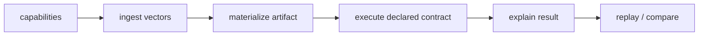

# Interfaces

Index interfaces expose governed retrieval rather than an unqualified nearest-
neighbor call. Every execution surface carries contract, identity, capability,
result, and refusal semantics that clients must preserve.

## Public surface map

| Surface | Entry | Contract |
| --- | --- | --- |
| Python | domain, application, contract, and interface modules | typed requests, artifacts, results, protocols, and refusals |
| CLI | `python -m bijux_canon_index.interfaces.cli.app` | JSON-first commands for discovery, ingest, materialize, execute, explain, replay, compare, and diagnostics |
| HTTP v1 | `bijux_canon_index.api.v1.app:app` | strict capability, ingest, artifact, execute, explain, replay, and inventory operations |
| Schema | `apis/bijux-canon-index/v1/schema.yaml` | versioned request and response vocabulary |
| Run files | `metadata.json`, `result.json`, `status.json` | execution evidence with explicit completion state |
| Plugins | registry entry points and capability contract | backend or provider registration subject to conformance |

The package root intentionally exports only `__version__`. Consumers import
the owning module so important contracts do not become an accidental flat API.
The installed wheel currently provides no console script; module invocation is
the supported CLI entry.

## Request-to-evidence contract

```mermaid
flowchart LR
    discover["capabilities"]
    admit["ingest vectors"]
    freeze["materialize artifact"]
    execute["execute declared contract"]
    inspect["explain result"]
    replay["replay / compare"]

    discover --> admit --> freeze --> execute --> inspect --> replay
```

An execution request identifies its artifact and declares intent, mode,
deterministic or non-deterministic contract, budget, metric, result count, and
applicable randomness policy. A response preserves correlation, execution,
artifact, backend, and result identities. Dropping those fields turns a
reviewable result into an unexplained ranking.

## Keep the caller envelope intact

Every surface must carry the same decision context even though its wire shape
differs:

| Envelope part | Before execution | After execution | Loss that invalidates review |
| --- | --- | --- | --- |
| purpose | intent, mode, deterministic posture | admitted or refused contract | retaining neighbors without the requested guarantee |
| input | artifact/index identity, vectors, metric, result count | normalized input and effective metric | retaining scores without the eligible corpus and vector identity |
| resource policy | latency, memory, error, and approximation budgets | observed cost, truncation, warnings, partial status | reporting completion without the budget disposition |
| implementation | required capabilities and provider/backend constraints | selected backend, version, parameters, plugin identity | naming only the requested backend when fallback executed |
| result | correlation and execution identity | ordered results, provenance, artifact and run references | copying IDs and scores while discarding execution identity |
| replay | randomness policy, witness requirements, comparison tolerance | replay diff and verdict | calling similar output equivalent without the original policy |

For CLI automation, retain JSON and process exit status together. For HTTP,
retain the structured response or refusal with correlation headers. For Python,
persist the typed request and execution artifact rather than serializing only
the result list. Run files are complete only when `status.json` agrees with the
metadata and result records.

## Accept an execution record

Automation should promote an index result only after the interface-specific
response has been reconciled with the common execution envelope:

1. retain the capability response that made the backend eligible;
2. serialize the admitted request, including intent, mode, contract, budget,
   artifact identity, metric and result count;
3. retain either the typed refusal or the returned execution and correlation
   identities—an empty neighbor list is not a replacement for a refusal;
4. when run files are requested, require `metadata.json`, `result.json`, and a
   terminal `status.json` that name the same execution; and
5. compare or replay only with the original request, artifact fingerprint,
   backend identity and tolerance policy present.

| Interface observation | Safe interpretation | Unsafe interpretation |
| --- | --- | --- |
| capability appears in discovery | the adapter declared availability for this process | the adapter is conformant or suitable for every contract |
| request returned neighbors | this execution produced an ordered result | the result is relevant, complete or factually correct |
| run files exist | publication began | the run is complete without a consistent terminal status |
| replay returned a diff | recorded executions were compared under the supplied policy | similar rankings are equivalent without an acceptable verdict |
| plugin loaded | registration and import succeeded | backend semantics, persistence and provenance are trustworthy |

This acceptance protocol is transport-independent. CLI JSON and exit status,
HTTP body and correlation headers, or Python typed values differ in shape, but
all must preserve the same execution identity and refusal semantics.

## Failure and compatibility

- Strict schema validation rejects unknown and malformed fields.
- Capability, resource, contract, artifact, and backend failures are distinct
  governed refusals; clients must not translate them into empty results.
- JSON is the automation-safe CLI format. Capture its payload and process exit
  status together.
- HTTP validation fails with `422`; known domain refusals use structured 4xx
  details; unexpected failures do not expose internals.
- Schema versions, fingerprint inputs, metric semantics, scoring versions,
  run-file meaning, and replay equivalence are compatibility boundaries.
- Plugin registration shows discoverability, not trust. Capability declarations
  and conformance evidence remain required.

## Contract index

| Need | Guide |
| --- | --- |
| Operate or automate commands | [CLI surface](cli-surface.md) |
| Integrate HTTP routes | [API surface](api-surface.md) |
| Resolve backend and runtime settings | [Configuration surface](configuration-surface.md) |
| Construct request and result payloads | [Data contracts](data-contracts.md) |
| Retain artifacts and complete runs | [Artifact contracts](artifact-contracts.md) |
| Import package-owned types and services | [Public imports](public-imports.md) |
| Follow complete execution journeys | [Operator workflows](operator-workflows.md) |
| Evaluate a caller-visible change | [Compatibility commitments](compatibility-commitments.md) |
| Start from runnable invocations | [Entrypoints and examples](entrypoints-and-examples.md) |
