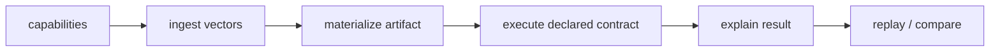

# Interfaces

Index interfaces expose governed retrieval rather than an unqualified nearest-
neighbor call. Every execution surface carries contract, identity, capability,
result, and refusal semantics that clients must preserve.

## Public surface map

| Surface | Entry | Contract |
| --- | --- | --- |
| Python | domain, application, contract, and interface modules | typed requests, artifacts, results, protocols, and refusals |
| CLI | `python -m bijux_canon_index.interfaces.cli.app` | JSON-first commands for discovery, ingest, materialize, execute, explain, replay, compare, and diagnostics |
| HTTP v1 | `bijux_canon_index.api.v1.app:app` | strict capability, ingest, artifact, execute, explain, replay, and inventory operations |
| Schema | `apis/bijux-canon-index/v1/schema.yaml` | versioned request and response vocabulary |
| Run files | `metadata.json`, `result.json`, `status.json` | execution evidence with explicit completion state |
| Plugins | registry entry points and capability contract | backend or provider registration subject to conformance |

The package root intentionally exports only `__version__`. Consumers import
the owning module so important contracts do not become an accidental flat API.
The installed wheel currently provides no console script; module invocation is
the supported CLI entry.

## Request-to-evidence contract

```mermaid
flowchart LR
    discover["capabilities"]
    admit["ingest vectors"]
    freeze["materialize artifact"]
    execute["execute declared contract"]
    inspect["explain result"]
    replay["replay / compare"]

    discover --> admit --> freeze --> execute --> inspect --> replay
```

An execution request identifies its artifact and declares intent, mode,
deterministic or non-deterministic contract, budget, metric, result count, and
applicable randomness policy. A response preserves correlation, execution,
artifact, backend, and result identities. Dropping those fields turns a
reviewable result into an unexplained ranking.

## Failure and compatibility

- Strict schema validation rejects unknown and malformed fields.
- Capability, resource, contract, artifact, and backend failures are distinct
  governed refusals; clients must not translate them into empty results.
- JSON is the automation-safe CLI format. Capture its payload and process exit
  status together.
- HTTP validation fails with `422`; known domain refusals use structured 4xx
  details; unexpected failures do not expose internals.
- Schema versions, fingerprint inputs, metric semantics, scoring versions,
  run-file meaning, and replay equivalence are compatibility boundaries.
- Plugin registration shows discoverability, not trust. Capability declarations
  and conformance evidence remain required.

## Contract index

| Need | Guide |
| --- | --- |
| Operate or automate commands | [CLI surface](cli-surface.md) |
| Integrate HTTP routes | [API surface](api-surface.md) |
| Resolve backend and runtime settings | [Configuration surface](configuration-surface.md) |
| Construct request and result payloads | [Data contracts](data-contracts.md) |
| Retain artifacts and complete runs | [Artifact contracts](artifact-contracts.md) |
| Import package-owned types and services | [Public imports](public-imports.md) |
| Follow complete execution journeys | [Operator workflows](operator-workflows.md) |
| Evaluate a caller-visible change | [Compatibility commitments](compatibility-commitments.md) |
| Start from runnable invocations | [Entrypoints and examples](entrypoints-and-examples.md) |
