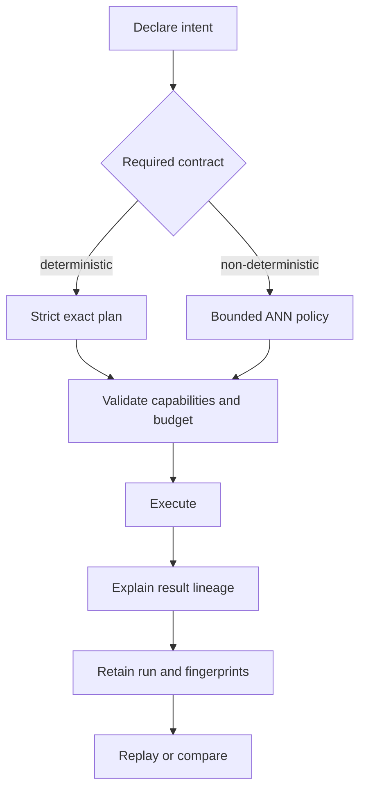

# Operator Workflows

Index operations begin by choosing the execution guarantee, then proving that
the environment and retained artifact can satisfy it. Backend selection comes
after that decision.



## Establish the Environment

```bash
python -m bijux_canon_index.interfaces.cli.app init \
  --config-path bijux_canon_index.toml

python -m bijux_canon_index.interfaces.cli.app \
  --config bijux_canon_index.toml \
  --output artifacts/bijux-canon-index/capabilities.json \
  capabilities

python -m bijux_canon_index.interfaces.cli.app \
  --config bijux_canon_index.toml \
  doctor
```

Review exact support, ANN support, vector-store consistency, replayability, and
resource limits. Do not proceed because a configured adapter name looks
familiar; use the reported capabilities.

## Pin the Stateful Boundary

The default execution backend is a SQLite database relative to the working
directory. Pin it before running a multi-command lifecycle:

```bash
export BIJUX_CANON_INDEX_STATE_PATH="$PWD/artifacts/bijux-canon-index/state/session.sqlite"
export BIJUX_CANON_INDEX_RUN_DIR="$PWD/artifacts/bijux-canon-index/runs"
```

Use the same values for ingest, materialize, execute, explain, and replay.
Changing the working directory without pinning these paths silently selects a
different state boundary. Setting `BIJUX_CANON_INDEX_BACKEND=memory` makes the
ledger process-local and is unsuitable for a sequence of separate CLI calls.

Vector-store configuration is a second boundary: it can persist vectors while
the SQLite backend retains documents, chunks, artifacts, and execution ledger
records. Retain and validate both. A reachable external vector store alone does
not prove that the governed artifact or execution context exists.

## Ingest and Materialize

```bash
python -m bijux_canon_index.interfaces.cli.app \
  --output artifacts/bijux-canon-index/ingest.json \
  ingest \
  --doc "signed records are retained for seven years" \
  --vector '[0.2, 0.8]' \
  --correlation-id retention-corpus

python -m bijux_canon_index.interfaces.cli.app \
  --output artifacts/bijux-canon-index/artifact.json \
  materialize \
  --execution-contract deterministic \
  --index-mode exact
```

Require the ingest count and correlation ID, then capture the returned artifact
ID and contract. Do not hard-code the example artifact name used below unless
it is the identifier returned by materialization in your state boundary.

## Validate an Exact Request

Use dry-run to inspect the resolved posture without claiming execution:

```bash
python -m bijux_canon_index.interfaces.cli.app execute \
  --vector '[0.2, 0.8]' \
  --artifact-id corpus-retention \
  --execution-contract deterministic \
  --execution-intent exact_validation \
  --execution-mode strict \
  --top-k 5 \
  --max-latency-ms 500 \
  --max-memory-mb 256 \
  --dry-run
```

In the chosen stateful boundary, execute only after the artifact ID resolves to
the expected corpus and vector fingerprint. Retain the execution ID and the
correlation ID; they identify different parts of the evidence chain.

## Bound an Approximate Request

An ANN run should declare at least the reason for approximation, budget,
randomness source, seed or non-replayable posture, quality target, witness
policy, and candidate limits:

```bash
python -m bijux_canon_index.interfaces.cli.app execute \
  --vector '[0.2, 0.8]' \
  --artifact-id corpus-retention-ann \
  --execution-contract non_deterministic \
  --execution-intent exploratory_search \
  --execution-mode bounded \
  --max-latency-ms 100 \
  --max-error 0.05 \
  --randomness-seed 42 \
  --randomness-sources ann \
  --randomness-bounded \
  --nd-profile balanced \
  --nd-target-recall 0.95 \
  --nd-witness-mode sample \
  --nd-witness-sample-k 20 \
  --nd-max-candidates 200 \
  --dry-run
```

Dry-run validates configuration shape; it does not measure recall or prove the
target backend meets the budget. Use `nd tune` and `bench` on representative
hardware and data before promoting a profile.

## Explain, Retain, and Compare

For every decision-bearing result:

1. resolve one returned vector through `explain` to document, chunk, artifact,
   score, contract, and execution;
2. require the on-disk run status to be `complete`;
3. retain metadata, result, and status files together;
4. capture vector, configuration, backend, and determinism fingerprints; and
5. replay under the same contract or compare two explicitly identified runs.

```bash
python -m bijux_canon_index.interfaces.cli.app compare \
  --run-a retention-baseline-run \
  --run-b retention-candidate-run \
  --execution-intent exact_validation
```

Compare contract and fingerprint context before ranking. A ranking delta after
a changed corpus or backend is a different experiment, not merely a degraded
repeat.
