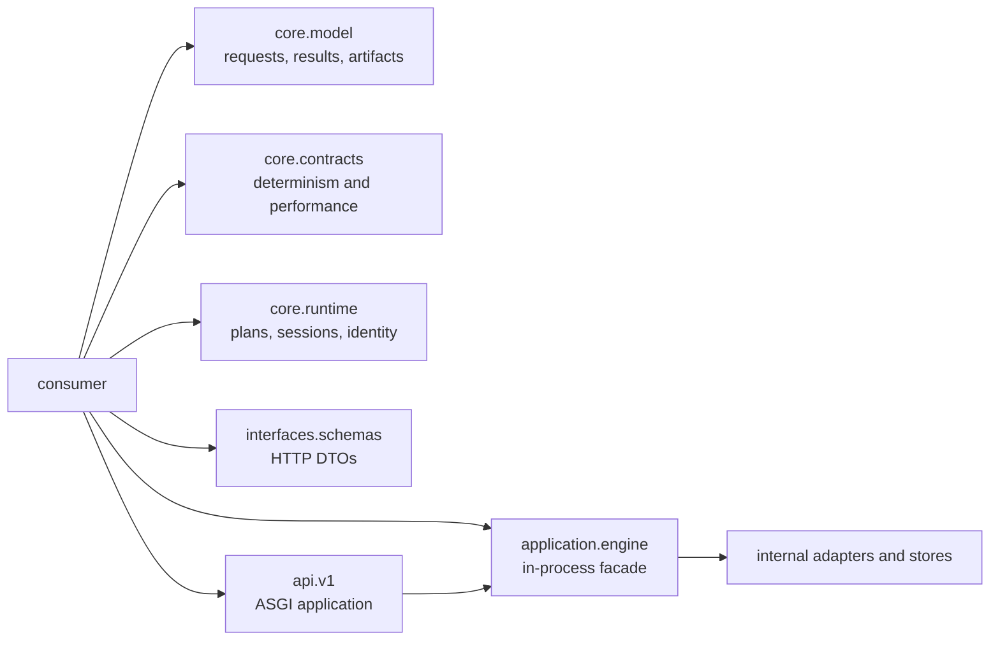

# Public Imports

The package root deliberately exports version metadata only:

```python
from bijux_canon_index import __version__
```

Import operational types from the namespace that owns their contract. This
keeps backend adapters and orchestration details from becoming accidental API.

## Why The Root Is Minimal

Index has several contracts that evolve at different rates: immutable domain
records, execution policy, in-process orchestration, HTTP validation, and
backend adapters. Exporting all of them from the root would erase those
boundaries and make an internal reorganization look like a product API break.



Choose the narrowest facade that owns the decision your application makes.

## Supported Namespaces

| Need | Import surface |
| --- | --- |
| core corpus and execution models | `bijux_canon_index.core.model` |
| determinism and performance contracts | `bijux_canon_index.core.contracts` |
| plans, sessions, modes, and execution identity | `bijux_canon_index.core.runtime` |
| validated HTTP request models | `bijux_canon_index.interfaces.schemas` |
| in-process execution facade | `bijux_canon_index.application.engine` |
| FastAPI application factory | `bijux_canon_index.api.v1` |

These are explicit namespace contracts, not a promise that every descendant
module is public. Prefer objects re-exported by each namespace's `__all__` over
deep imports from its implementation files.

For example:

```python
from bijux_canon_index.application.engine import VectorExecutionEngine
from bijux_canon_index.core.contracts import ExecutionContract
from bijux_canon_index.core.model import ExecutionBudget, ExecutionRequest
from bijux_canon_index.core.runtime import ExecutionIntent, ExecutionMode

request = ExecutionRequest(
    request_id="retention-query",
    text=None,
    vector=(0.2, 0.8),
    top_k=5,
    execution_contract=ExecutionContract.DETERMINISTIC,
    execution_intent=ExecutionIntent.EXACT_VALIDATION,
    execution_mode=ExecutionMode.STRICT,
    execution_budget=ExecutionBudget(max_latency_ms=250),
)

engine = VectorExecutionEngine()
capabilities = engine.capabilities()
```

Capability discovery is safe before submitting the request; actual execution
also needs an artifact and configured backend state. The example intentionally
does not imply that constructing a request creates or populates a corpus.

## Read The Objects By Layer

| Object family | What construction establishes | What it does not establish |
| --- | --- | --- |
| core request and budget | field and domain invariants | backend capability or executable state |
| execution contract and intent | requested determinism and purpose | that the selected backend can honor them |
| execution plan and session | admitted choices, identities, and lifecycle state | successful execution or replay |
| execution result and artifact | retained outcome, costs, fingerprints, and contract state | equivalence to a later run |
| HTTP payload | strict wire-boundary validation | interchangeability with a core dataclass |

This separation prevents a validated request from being mistaken for an
admitted plan, or a stored artifact from being mistaken for a successful
replay verdict.

## HTTP Models and Application

```python
from bijux_canon_index.api.v1 import build_app
from bijux_canon_index.interfaces.schemas import ExecutionRequestPayload
```

Boundary payloads are strict validation models. Core dataclasses express domain
invariants. Do not substitute one for the other merely because their field names
overlap.

Map explicitly between wire and core objects at the application boundary. That
keeps defaults, enum encoding, validation errors, and future schema evolution
visible to reviewers.

## Stability And Upgrade Evidence

| Imported surface | Evidence to run before upgrading |
| --- | --- |
| `core.model`, `core.contracts`, or `core.runtime` | construction/invariant tests plus fingerprint and identity comparisons |
| `application.engine` | capability discovery and representative execution/refusal tests with configured stores |
| `interfaces.schemas` | JSON schema or OpenAPI diff and payload validation |
| `api.v1` | pinned OpenAPI contract and live route tests for the operations used |

Exact and approximate retrieval need different acceptance criteria. Preserve
the declared execution contract and compare ranked results, provenance, and
replay evidence under that contract; do not reduce compatibility to “the query
returned neighbors.”

Avoid imports from `infra.adapters`, `application.orchestration`, CLI command
modules, or underscore-prefixed modules. They are implementation surfaces and
may evolve without root-level compatibility guarantees. `bijux_vex` forwards
the canonical package for legacy consumers; new code should use the canonical
namespace.

See [Data Contracts](data-contracts.md) for the distinction between core and
boundary models.
