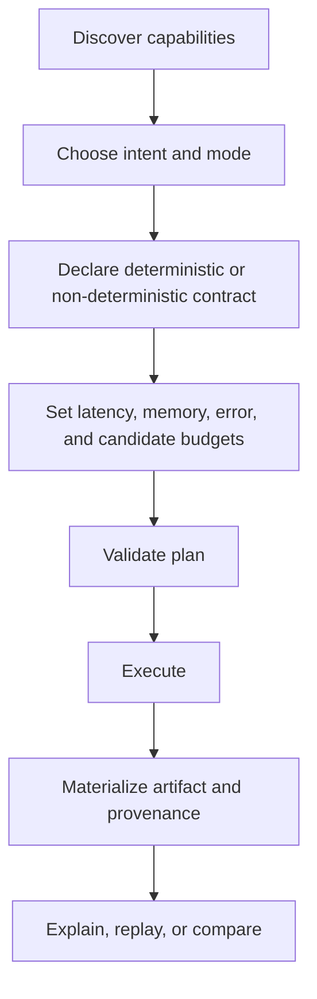

# Common Workflows

Reliable vector retrieval begins with contract selection, not backend
selection. The normal operating path discovers capability, declares acceptable
loss and resource bounds, executes, and retains enough evidence to explain or
replay the result.



## Establish a workspace

Create the default configuration and governed artifact locations once:

```bash
python -m bijux_canon_index.interfaces.cli.app init \
  --config-path bijux_canon_index.toml
python -m bijux_canon_index.interfaces.cli.app capabilities
python -m bijux_canon_index.interfaces.cli.app doctor
```

Commit configuration only when it contains no environment-specific secrets or
paths. Runtime records default to `artifacts/bijux-canon-index/runs`; set
`BIJUX_CANON_INDEX_RUN_DIR` when the application owns another durable location.

## Validate exact retrieval

Use `exact_validation` with `strict` mode and a deterministic contract for
golden results, migrations, parity checks, and other work where approximation
would invalidate the conclusion.

1. Inspect capabilities and confirm the exact runner is available.
2. Identify the artifact and vector dimensions before execution.
3. Set explicit resource bounds.
4. Run with `--dry-run` first when refusal behavior or configuration has
   changed.
5. Execute and retain the run identifier, plan fingerprint, backend identity,
   result, and observed cost.

Strict refusal is useful evidence. Do not convert an unsupported capability or
budget violation into an empty result, because that erases the distinction
between “no neighbor matched” and “the declared contract could not run.”

## Operate approximate retrieval

Use a non-deterministic contract only when latency, scale, or search behavior
justifies bounded approximation. Declare:

- randomness sources and a seed, or an explicit non-replayable posture;
- target recall and an ANN profile;
- candidate and index-memory caps;
- witness mode and sample size;
- low-signal and adaptive-`k` policy;
- index, runner, and ANN parameter identity.

Sampled exact witnesses provide evidence about ANN quality; they do not make
every approximate result exact. When an index, parameter, or backend changes,
strict replay should refuse the comparison unless the new run is intentionally
treated as a separate experiment.

## Explain and compare results

Use `explain` to trace one result back to the execution declaration and
backend. Use `replay` when the original artifact and replay conditions still
exist. Use `compare` when the question is whether two recorded executions
diverged.

Interpret differences in this order:

1. artifact and corpus fingerprint;
2. execution contract and mode;
3. backend, runner, and embedding identity;
4. exact or ANN parameters;
5. randomness and witness declarations;
6. result ranking and observed cost.

Comparing only the final neighbor identifiers can conceal a contract change
that makes the two runs scientifically or operationally incomparable.

## Audit an environment

```bash
python -m bijux_canon_index.interfaces.cli.app audit
python -m bijux_canon_index.interfaces.cli.app list-artifacts --limit 20
python -m bijux_canon_index.interfaces.cli.app list-runs --limit 20
```

The audit reports deterministic guarantees, ANN support, selected backend, and
known limitations. Run it after changing a vector-store adapter, execution
runner, or target environment.

## Retain the evidence chain

For a result that will support a decision, retain:

- execution request, intent, mode, contract, and budget;
- validated plan and plan fingerprint;
- corpus or artifact fingerprint;
- backend, runner, embedding, and parameter identity;
- randomness and witness declarations for approximate work;
- result, observed cost, run identifier, and provenance;
- replay or comparison outcome when reproducibility is claimed.

That evidence distinguishes an exact repeat, a bounded comparison, a changed
experiment, and an unsupported replay.
