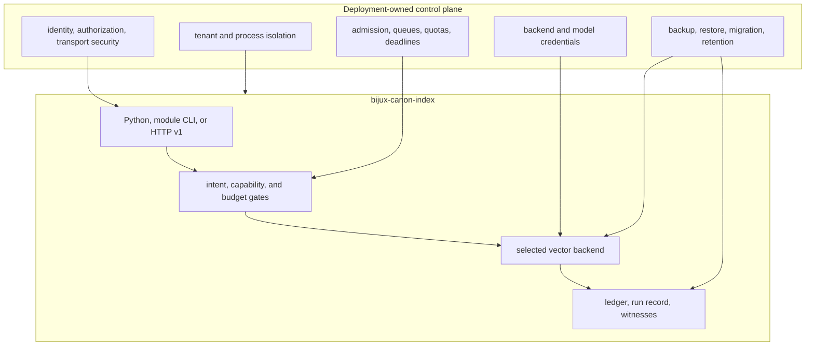

# Deployment Boundaries

Index can execute in an application process, through its module CLI, or behind
the v1 HTTP adapter. It governs vector-execution evidence, not the surrounding
service control plane. Storage topology must be selected deliberately because
the ledger, run files, vector state, native ANN indexes, and remote collections
are distinct persistence domains.

## Responsibility boundary

## Deployment shapes

| Shape | Use | Boundary |
| --- | --- | --- |
| Embedded Python | A host owns resource construction and invokes the execution engine directly | Do not pass raw backend clients around the engine's validation and evidence path |
| Installed or module CLI | Local and automated artifact, execution, explain, replay, and audit workflows | Invoke `bijux-canon-index` or the equivalent `python -m bijux_canon_index.interfaces.cli.app` |
| HTTP v1 | A controlled service adapter for capability, artifact, execution, explain, and replay operations | Add external authentication, per-operation authorization, TLS, quotas, and tenant routing |
| Remote vector backend | Service-backed vector state such as Qdrant | Bind collection/snapshot identity and consistency behavior to the run; backend availability is external |

## Persistence topology

The execution ledger records artifact and run state. The file run store writes
`metadata.json`, `result.json`, and `status.json`, with `complete` marking a
loadable run. Vector rows, ANN index files, embedding caches, and remote
collections live elsewhere. Backup and restore are correct only when these
identities remain bound.

SQLite is appropriate for controlled local state, but file locking and atomic
replacement are not distributed coordination. A horizontally scaled service
needs application-owned writer coordination, shared-state design, and explicit
read-after-write expectations. Memory backends are process-local and disappear
on restart.

## Production controls

The deployment supplies:

- authenticated principals and authorization for ingest, mutation, execution,
  explain, replay, and artifact access;
- tenant-specific state, run, cache, collection, and plugin boundaries;
- maximum vectors, dimensions, query size, `top_k`, candidate pool, memory,
  distance computations, ANN probes, and wall time;
- separate admission policy for expensive ANN construction and exact witness
  work;
- secret injection and URI redaction for vector stores and model providers;
- reviewed and pinned native dependencies and plugins;
- coordinated schema migration, backup, restore, integrity verification, and
  retention across every persistence domain;
- monitoring for refusal reasons, backend availability, divergence, budget
  exhaustion, witness quality, incomplete runs, and drift.

## Operational acceptance

Validate the resolved capability report against each intended execution mode
before routing traffic. Exercise backend loss, incomplete writes, restart,
restore, read-only operation, and changed-index replay. Confirm that an
incompatible metric, dimension, deterministic claim, or replay request is
refused rather than silently downgraded.

The [security and safety](security-and-safety.md) guide covers plugin and
credential risk. [Integration seams](../architecture/integration-seams.md)
describes the identities that must survive deployment boundaries.
