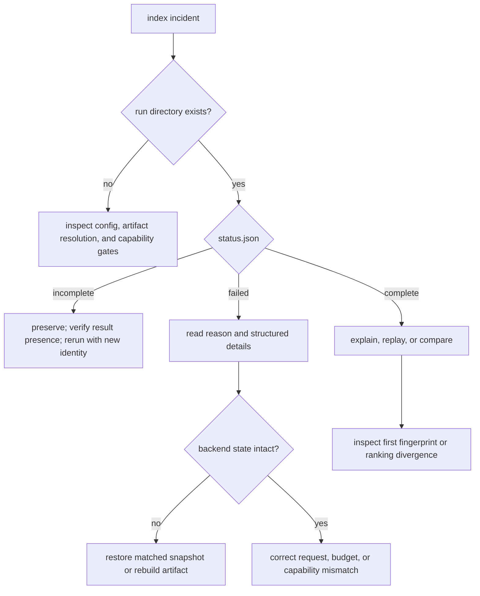

# Failure Recovery

Recover index incidents by preserving the execution declaration and locating
the first broken persistence or capability boundary. An incomplete or failed
run is diagnostic evidence; it is never loadable success and has no in-place
resume contract.

## Recovery path

## Preserve before changing state

Retain the run directory, execution/artifact IDs, resolved secret-free
configuration, capability report, redacted backend lineage, package and
adapter versions, and the exact command or request. For ANN work, also retain
the index hash, runner version, parameters, seed/randomness declaration,
witness report, and decision trace.

Do not rebuild, tune, upgrade, or repoint the backend before collecting this
set. Those actions can remove the distinction between changed backend state
and changed query behavior.

## Failure classes

| Symptom | Classification | Recovery |
| --- | --- | --- |
| no run directory | pre-execution validation or initialization | correct configuration, artifact identity, or capability refusal, then create a new run |
| `incomplete` status | interruption before commit marker | preserve partial files; rerun with a new run ID rather than editing status |
| `failed` status | governed execution failure | use recorded reason/details; retry only a classified transient backend failure |
| artifact schema/version rejected | compatibility failure | use a supported migration or rematerialize from trusted source vectors |
| dimension or metric mismatch | contract failure | restore matching artifact/query inputs; never coerce vectors silently |
| backend unavailable or locked | resource availability | restore service/file access and verify capabilities before rerun |
| backend capability refusal | unsupported requested semantics | choose an eligible backend or explicitly change the execution contract |
| ANN circuit open | repeated approximate-backend failure | investigate dependency health, wait for controlled cooldown, then validate independently |
| deterministic divergence | integrity or implementation drift | compare vector, configuration, backend, determinism, plan, and result fingerprints |
| approximate quality regression | index/parameter/data drift | compare index hash, parameters, exact witness overlap, rank instability, and bounds |

## Restore the persistence set

The ledger, run directory, vector store, ANN index, embedding cache, and remote
collection are not interchangeable backups. Restore the matched generation
whose artifact and backend fingerprints agree with the run. If that set cannot
be reconstructed, classify historical replay as unavailable and materialize a
new artifact from trusted source vectors.

Memory backend state cannot be recovered after process loss. A run record that
references vanished memory state can still explain the historical execution,
but it cannot make the backend replayable.

## Retry and rebuild rules

Retry only after confirming the request is idempotent and the failure is
transient. Validation, budget, capability, schema, metric, dimension, and
deterministic-divergence failures do not improve through retries.

Rebuilding is appropriate when source vectors, order, configuration, backend,
and algorithm inputs are available. The rebuilt artifact receives its own
identity and fingerprints. Do not overwrite a completed artifact or relabel a
new native index as the original one.

## Recovery acceptance

Recovery is complete when:

- capability discovery reports the intended exact or ANN behavior;
- artifact schema, vector order, metric, dimension, and fingerprints validate;
- the new run reaches `complete` through the normal three-file protocol;
- explanation resolves results to the expected artifact and execution;
- exact replay matches all required fingerprints, or approximate replay reports
  the declared bounded verdict with visible differences; and
- the original failed or divergent evidence remains unchanged for comparison.

Use [observability and diagnostics](observability-and-diagnostics.md) to build
the incident evidence set. [Artifact contracts](../interfaces/artifact-contracts.md)
defines the lifecycle marker and persistence relationships used here.
