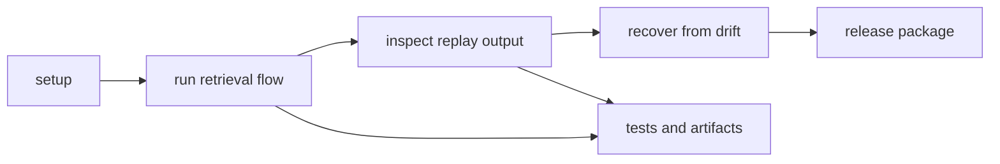

# Operations

Open this section when you need to run index work repeatably: install it, exercise retrieval flows, diagnose replay drift, release it, or recover from failure without guessing what the package expected.

## Operating Loop

Index operations need to make replayability practical, not rhetorical. A
maintainer should be able to move from a clean setup to a reproducible query
path, inspect the replay evidence, and recover from drift without treating the
backend as a black box.

## Read These First

- open [Installation and Setup](https://bijux.io/bijux-canon/03-bijux-canon-index/operations/installation-and-setup/) first when you need a clean package starting point
- open [Observability and Diagnostics](https://bijux.io/bijux-canon/03-bijux-canon-index/operations/observability-and-diagnostics/) when retrieval or replay behavior no longer matches expectation
- open [Failure Recovery](https://bijux.io/bijux-canon/03-bijux-canon-index/operations/failure-recovery/) when index output or search behavior has already gone wrong

## Operational Risk

The main operational risk here is hiding retrieval and replay assumptions in environment state or one-off debugging habits.

## First Proof Check

- `pyproject.toml`, `README.md`, and package-local entrypoints for checked-in operating truth
- `tests` and runnable workflows for evidence that the package can be operated repeatably
- release notes and version metadata when the work changes caller expectations

## Pages In This Section

- [Installation and Setup](https://bijux.io/bijux-canon/03-bijux-canon-index/operations/installation-and-setup/)
- [Local Development](https://bijux.io/bijux-canon/03-bijux-canon-index/operations/local-development/)
- [Common Workflows](https://bijux.io/bijux-canon/03-bijux-canon-index/operations/common-workflows/)
- [Observability and Diagnostics](https://bijux.io/bijux-canon/03-bijux-canon-index/operations/observability-and-diagnostics/)
- [Performance and Scaling](https://bijux.io/bijux-canon/03-bijux-canon-index/operations/performance-and-scaling/)
- [Failure Recovery](https://bijux.io/bijux-canon/03-bijux-canon-index/operations/failure-recovery/)
- [Release and Versioning](https://bijux.io/bijux-canon/03-bijux-canon-index/operations/release-and-versioning/)
- [Security and Safety](https://bijux.io/bijux-canon/03-bijux-canon-index/operations/security-and-safety/)
- [Deployment Boundaries](https://bijux.io/bijux-canon/03-bijux-canon-index/operations/deployment-boundaries/)

## Leave This Section When

- leave for [Interfaces](https://bijux.io/bijux-canon/03-bijux-canon-index/interfaces/) when the live problem is contract shape rather than package operation
- leave for [Architecture](https://bijux.io/bijux-canon/03-bijux-canon-index/architecture/) when a workflow problem exposes structural drift underneath it
- leave for [Quality](https://bijux.io/bijux-canon/03-bijux-canon-index/quality/) when the package runs but the real question is whether the evidence is strong enough

## Design Pressure

If replay drift can only be diagnosed by backend intuition or private habits,
the package is not operationally honest enough yet. The checked-in workflow
needs to expose how search behavior is examined and recovered.
