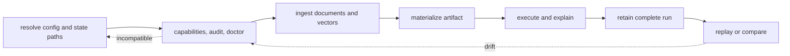

# Operations

Operate index as an evidence-producing execution service. The safe path starts
with capability discovery, makes storage locations explicit, materializes an
artifact under a declared contract, and retains a complete run before making a
replay claim.

## Operating lifecycle

```mermaid
flowchart LR
    configure["resolve config and state paths"]
    discover["capabilities, audit, doctor"]
    ingest["ingest documents and vectors"]
    materialize["materialize artifact"]
    execute["execute and explain"]
    retain["retain complete run"]
    compare["replay or compare"]

    configure --> discover --> ingest --> materialize --> execute --> retain --> compare
    discover -. incompatible .-> configure
    compare -. drift .-> discover
```

## Choose the actual entry surface

The canonical distribution does not install a `bijux-canon-index` console
script. Select an implemented surface deliberately:

| Operating context | Entry surface | State and evidence responsibility |
| --- | --- | --- |
| shell or automation | `python -m bijux_canon_index.interfaces.cli.app` with JSON output | retain command, exit status, payload, state path and run directory |
| service client | versioned HTTP application and schema | retain request/response identity; deploy authentication, isolation and durable state externally |
| in-process integration | named application, domain, contract and infrastructure modules | caller owns composition and persistence boundaries explicitly |
| preserved automation | `bijux-vex` compatibility command | verify alias delegation, then plan migration to canonical Python or HTTP ownership |

Do not invent a renamed command from package naming symmetry. Likewise, an
HTTP schema is not proof that a configured backend, plugin, or vector store is
available; run capability discovery in the environment that will execute the
request.

## Persistence boundaries

| State | Default | Operational consequence |
| --- | --- | --- |
| execution ledger | SQLite at `artifacts/bijux-canon-index/state/session.sqlite` | use an explicit `BIJUX_CANON_INDEX_STATE_PATH` in automation because relative paths depend on the working directory |
| run evidence | `artifacts/bijux-canon-index/runs` | preserve each complete three-file run directory; override with `BIJUX_CANON_INDEX_RUN_DIR` when required |
| memory backend | process-local | state does not survive a new process |
| vector store | selected URI and adapter options | vector persistence does not replace the ledger or run record |

## Operational evidence

| Question | Evidence |
| --- | --- |
| Was the backend eligible? | capability report, audit output, selected backend metadata |
| What actually ran? | artifact identity, normalized request, plan fingerprint, run metadata |
| Did execution finish? | `status.json` equals `complete` and a readable `result.json` exists |
| Why did a result rank here? | explain payload joining document, chunk, vector, metric, score, artifact, and execution |
| Is replay equivalent? | original and replay fingerprints, mismatch details, randomness policy, tolerance decision |
| Is approximate quality acceptable? | target bounds, witness result, ANN parameters, decision trace, observed metrics |

## Incident routing

| Symptom | Inspect first | Safe response |
| --- | --- | --- |
| No run directory | initialization, artifact resolution, and early validation | correct the pre-execution failure; do not invent run evidence |
| Run remains incomplete | status, process interruption, and result-file presence | preserve for diagnosis, then rerun; never load it as success |
| Run is failed | recorded reason and details | address the typed cause before retrying |
| Deterministic replay differs | vector, configuration, backend, determinism, and plan fingerprints | refuse equivalence until the divergence is explained |
| ANN replay differs | index hash, adapter version, parameters, seed, bounds, and witness | apply the declared equivalence policy; never claim bit identity |
| Backend cannot satisfy request | current capabilities and v1 exclusions | select an eligible supported backend or change the declared contract explicitly |

## Security and deployment boundary

The HTTP application does not supply authentication, authorization, tenant
isolation, provider credential governance, or network sandboxing. Run files are
atomically replaced but are not self-authenticating as a set. Apply deployment
controls externally, redact vector-store credentials in diagnostics, and add a
digest or signature when evidence crosses a trust boundary.

## Operate by need

| Need | Guide |
| --- | --- |
| Install the package and supported extras | [Installation and setup](installation-and-setup.md) |
| Work against isolated local state | [Local development](local-development.md) |
| Execute normal exact and bounded journeys | [Common workflows](common-workflows.md) |
| Read run files and diagnose drift | [Observability and diagnostics](observability-and-diagnostics.md) |
| Plan vector count, latency, memory, and ANN behavior | [Performance and scaling](performance-and-scaling.md) |
| Recover artifacts, runs, or backends | [Failure recovery](failure-recovery.md) |
| Define production controls | [Security and safety](security-and-safety.md) and [Deployment boundaries](deployment-boundaries.md) |
| Release a compatibility-sensitive change | [Release and versioning](release-and-versioning.md) |
