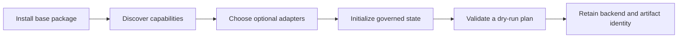

# Installation and Setup

`bijux-canon-index` supports Python 3.11 through 3.14. Install the base package
for the typed execution engine, module CLI, FastAPI application, and local
memory or SQLite paths. Add extras only for the adapters an environment uses.



## Install

```bash
python -m venv .venv
source .venv/bin/activate
python -m pip install --upgrade pip
python -m pip install bijux-canon-index
```

The canonical wheel registers `bijux-canon-index`. Verify the import and the
installed application:

```bash
python -c "import bijux_canon_index; print(bijux_canon_index.__version__)"
bijux-canon-index --help
bijux-canon-index capabilities
```

## Choose Optional Capabilities

```bash
# YAML configuration files
python -m pip install 'bijux-canon-index[config]'

# hnswlib approximate-nearest-neighbor execution
python -m pip install 'bijux-canon-index[nd]'

# NumPy, FAISS, and Qdrant client adapters
python -m pip install 'bijux-canon-index[vdb]'

# CPU-local embedding acquisition, inference, and FAISS
python -m pip install 'bijux-canon-index[local-cpu]'

# Uvicorn and API validation dependencies
python -m pip install 'bijux-canon-index[api]'
```

Extras install client libraries, not external services. A Qdrant deployment
still needs an accessible service and its own authentication, persistence, and
backup configuration. Capability discovery reports whether an adapter can
actually be used in the current environment.

## Acquire a pinned model for dense retrieval

On Linux CPU hosts, prevent installation of CUDA runtime packages by installing
PyTorch from its CPU wheel index before the profile:

```bash
python -m pip install torch --index-url https://download.pytorch.org/whl/cpu
python -m pip install 'bijux-canon-index[local-cpu]'
```

On macOS, `local-cpu` is supported on Python 3.11. The profile constrains FAISS
1.7.4 with NumPy 1.26 because newer FAISS wheels conflict with PyTorch's OpenMP
runtime, while FAISS 1.7.4 has no Python 3.12+ wheel.

The `bijux-cli` dependency publishes a Linux x86_64 wheel. On Linux ARM64,
install a C build toolchain before installing Index so pip can build that
dependency from its source distribution. For example, Debian and Ubuntu hosts
can use `sudo apt-get install build-essential`.

Model acquisition is explicit and network-backed. It never runs during lexical
workspace initialization or as an implicit side effect of a retrieval request:

```bash
bijux-canon-index model acquire \
  --profile local-minilm-384 \
  --cache-root artifacts/bijux-canon-index/models
```

The output is a stable validation record. It includes the immutable source and
revision, Apache-2.0 model-card pointer, exact local file digests, dimension,
runtime compatibility, validation result, and offline-reuse status. Subsequent
validation is network-free:

```bash
bijux-canon-index model validate \
  --model-root artifacts/bijux-canon-index/models/local-minilm-384/1110a243fdf4706b3f48f1d95db1a4f5529b4d41
```

If the pinned files were acquired by another controlled process, replace
`validate` with `register`. Registration writes the canonical lock only after
every required ordinary file is present, then performs the same CPU smoke.

## Read Capability Output Conservatively

| Field | Operational meaning |
| --- | --- |
| `available` | required client code can be loaded in this environment |
| `status` or `experimental` | stability posture, not merely import success |
| `deterministic_exact` | whether the exact path promises deterministic scoring |
| `consistency` | visibility guarantee expected after mutation |
| `replayable` | whether the declared backend path can support the package replay contract |
| `notes` | exclusions, fallback behavior, or unavailable native support |

An available adapter is not a healthy service. Probe the selected backend,
exercise a refusal path, and retain the capability report with the run.

## Initialize Local State

```bash
mkdir -p artifacts/bijux-canon-index
python -m bijux_canon_index.interfaces.cli.app init \
  --config-path artifacts/bijux-canon-index/config.toml
python -m bijux_canon_index.interfaces.cli.app doctor
```

By default, SQLite state, embedding cache, and run records stay under
`artifacts/bijux-canon-index/`. For a service or scheduled job, pin the run
directory rather than relying on its working directory:

```bash
export BIJUX_CANON_INDEX_RUN_DIR=/var/lib/bijux-canon-index/runs
```

The selected operating-system user must be able to create and atomically
replace files in that directory.

## Run a Smoke Execution

```bash
python -m bijux_canon_index.interfaces.cli.app execute \
  --vector '[0.2, 0.8]' \
  --artifact-id setup-smoke \
  --execution-contract deterministic \
  --execution-intent exact_validation \
  --execution-mode strict \
  --top-k 1 \
  --dry-run

python -m bijux_canon_index.interfaces.cli.app list-runs --limit 5
```

The dry run validates planning without claiming that retrieval occurred. Use a
real artifact and omit `--dry-run` only after the chosen backend and corpus are
configured.

## Serve the HTTP Boundary

With the `api` extra installed:

```bash
uvicorn bijux_canon_index.api.v1.app:app \
  --host 127.0.0.1 \
  --port 8000
```

Then inspect capabilities:

```bash
curl --fail-with-body http://127.0.0.1:8000/capabilities
```

## Repository Checkout

```bash
make install
make -f "$PWD/makes/packages/bijux-canon-index.mk" \
  -C packages/bijux-canon-index help
make test PACKAGE=bijux-canon-index
```

Package Makefiles are repository profiles under `makes/packages/`; the package
directory does not contain a standalone Makefile. Use the root dispatcher for
normal checks. The explicit profile path is absolute because Make changes
directory before resolving `-f`; use that form when inspecting package targets.

Use `make docs-check` for handbook changes. Repository-wide validation is
reserved for changes that cross package, API, build, or release boundaries.

## Setup Checklist

- The canonical import and module CLI resolve from the same environment.
- Capability output matches the intended deterministic or ANN execution mode.
- Optional native libraries and external services are installed separately and
  report healthy.
- State, cache, and run paths are explicit and writable.
- The application understands which backend state must accompany run evidence
  for replay.

Continue with [state and persistence](../architecture/state-and-persistence.md)
and [entrypoint examples](../interfaces/entrypoints-and-examples.md).
