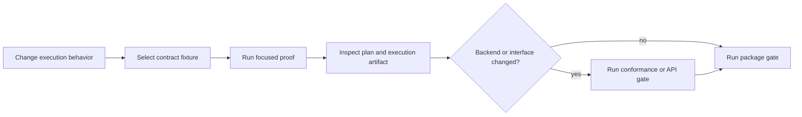

# Local Development

Develop index changes against an explicit execution contract. Backend code is
only one part of the result: intent, mode, budget, capability decision,
artifact identity, rank order, approximation evidence, cost, and replay posture
must remain consistent.



## Bootstrap from the repository root

```bash
make install
make -f "$PWD/makes/packages/bijux-canon-index.mk" \
  -C packages/bijux-canon-index help
```

Run package gates through the root dispatcher:

```bash
make test PACKAGE=bijux-canon-index
make lint PACKAGE=bijux-canon-index
make quality PACKAGE=bijux-canon-index
```

The package profile creates its environment under
`artifacts/bijux-canon-index/venv`; `packages/bijux-canon-index/.venv` is a
stable alias. Do not invoke `make -C packages/bijux-canon-index` without an
absolute `-f` profile path; there is no package-local Makefile, and Make applies
the directory change before resolving a relative profile.

## Start with the nearest contract test

After the package environment exists:

```bash
packages/bijux-canon-index/.venv/bin/python -m pytest \
  packages/bijux-canon-index/tests/<area>/<test-file>.py -q
```

| Changed behavior | Evidence to inspect |
| --- | --- |
| request or plan | intent, mode, contract, budget, refusal, and fingerprint |
| exact scoring | metric semantics, score, stable ties, rank order, and witness |
| ANN execution | seed, parameters, candidates, recall evidence, exact rescoring, and loss bound |
| artifact construction | ordered vectors, corpus identity, configuration, immutability, and digest |
| backend adapter | capability discovery, dimension/metric refusal, consistency, timeout, and cleanup |
| persistence | run isolation, ledger identity, cache behavior, atomic file replacement, and recovery |
| replay or compare | compatibility decision, structured diff, drift class, and original policy |
| plugin | entry-point discovery, duplicate registration, conformance, and untrusted-code posture |

An adapter import is not evidence that the backend is usable. Exercise
capability discovery and the declared refusal path in the same environment as
the focused backend proof.

## Validate interface and freeze surfaces

The wheel currently exposes a module CLI, not a canonical console script. When
command wiring changes, run the module form in the package environment and
retain structured output:

```bash
packages/bijux-canon-index/.venv/bin/python \
  -m bijux_canon_index.interfaces.cli.app capabilities
```

For HTTP or schema work:

```bash
make api PACKAGE=bijux-canon-index
```

The index API is a frozen v1 surface. Generated OpenAPI output must match the
checked-in schema; do not update the freeze merely to silence an unexplained
diff.

Use `make build PACKAGE=bijux-canon-index` when imports, package data, optional
dependencies, API freeze assets, or distribution metadata changed. Use `make
docs-check` for handbook changes.

The index build profile is intentionally stronger than packaging alone: its
configured pre-targets include formatting, lint, tests, quality, security, and
SBOM generation. Use the focused target during development and reserve `build`
for a distribution boundary that needs that wider evidence.

## Inspect The Artifact Tree

| Path | Expected evidence |
| --- | --- |
| `artifacts/bijux-canon-index/test/` | test, coverage, and benchmark output |
| `artifacts/bijux-canon-index/api/` | generated schema and freeze/drift diagnostics |
| `artifacts/bijux-canon-index/release/` | wheel, source distribution, checksums, and release metadata |
| `artifacts/bijux-canon-index/sbom/` | dependency inputs, CycloneDX output, and summary |

The API freeze proves representation agreement. It does not prove an external
vector service is reachable, configured, or behaviorally conformant.

## Preserve comparison evidence

Keep fixed vectors, query, artifact identity, backend and parameter identity,
result order, witness output, and observed cost together. If an exact and ANN
path differ, document the declared loss contract rather than normalizing their
outputs into apparent parity.

See [change validation](../quality/change-validation.md) for risk routing and
[known limitations](../quality/known-limitations.md) before widening a backend
claim.
