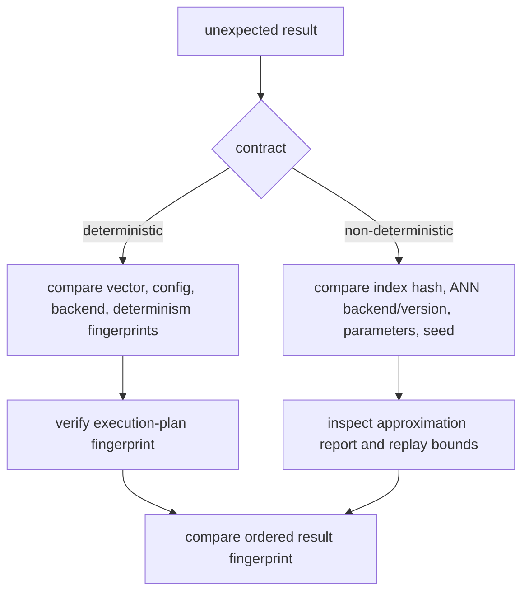

# Observability and Diagnostics

Index diagnostics answer four questions: which contract was requested, which
backend and artifact were selected, which plan ran, and whether retained
evidence supports replay.

## Start With the Run Record

Use the correlation or execution ID from the response to locate the run. Read
the files in this order:

1. `status.json` — determine whether the run completed, failed, or stopped
   before finalization;
2. `metadata.json` — inspect request policy, backend resolution, ANN settings,
   and determinism fingerprints; and
3. `result.json` — inspect the execution result, ordered vector IDs, and ANN
   decision trace.

Do not treat a directory with `incomplete` or `failed` status as a successful
result, even when a partial result file exists.

## Diagnostic Surfaces

| Surface | Use |
| --- | --- |
| `config show` | inspect effective configuration with secrets redacted |
| `metrics` | read in-process counters and timer samples |
| `debug-bundle` | combine config, backend capabilities, reachability, and metrics |
| `debug-bundle --include-provenance` | add artifact IDs and latest execution IDs |
| `explain` | connect a result ID to document, chunk, score, artifact, and execution |
| `replay` | evaluate recorded equivalence and fingerprint differences |
| `compare` | compare artifacts, complete runs, or exported bundles |

The debug bundle reports a redacted vector-store URI. Preserve that redaction
when attaching diagnostics to an issue or incident record.

## Reading Determinism Evidence

For deterministic execution, any changed vector, configuration, backend, or
plan fingerprint is a material divergence. For non-deterministic execution,
also inspect declared randomness sources, seed, ANN index hash, adapter version,
candidate policy, witness report, and replay strictness.

Strict replay refuses absent provenance, non-replayable declarations, missing
randomness annotations, incompatible ANN backends, index drift, and parameter
drift. A permitted approximate divergence remains visible in replay details; it
is not rewritten into a deterministic match.

## Failure Signals

Backend availability, capability, and divergence errors increment
`backend_failures_total`. Resource and contract refusals remain typed boundary
errors and map to stable CLI exits. An unexpected exception exits unsuccessfully
but is not converted into a domain refusal.

When metrics show backend failures but the run directory is absent, investigate
initialization and artifact resolution. When metadata exists but the run is
failed, its status reason is the primary evidence. When a run is complete but
replay differs, compare the recorded fingerprints before inspecting ranking
code.

## Incident Evidence Set

Retain the smallest evidence set that can reproduce the issue:

- complete run directory;
- artifact ID and artifact definition;
- redacted debug bundle;
- query vector fingerprint rather than sensitive raw input where possible;
- package version and backend adapter version; and
- replay or comparison output.

This set explains execution without exposing vector-store credentials or
requiring an unrestricted copy of the indexed corpus.
