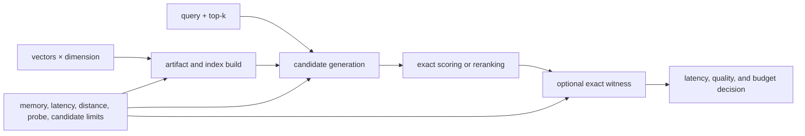

# Performance and Scaling

Index performance is a declared tradeoff between vector count, dimension,
metric, exact work, approximation, memory, latency, and quality evidence. Pick
an execution contract before tuning a backend; a faster run that violates its
budget or recall posture is a refusal, not an optimization.

## Cost and evidence path

## Scaling dimensions

| Dimension | Exact path | Approximate path |
| --- | --- | --- |
| vector count | increases distance computations linearly for a full scan | increases index size, build work, and search space |
| vector dimension | increases vector memory and each distance calculation | also affects native index memory and transfer cost |
| `top_k` | increases retained and sorted results | influences candidate size, witness sample, and reranking work |
| metric and normalization | changes scoring work and comparability | must match index construction and ANN space |
| candidate pool | not required for direct exact results | larger pools trade latency and memory for possible recall |
| HNSW `m` / `ef_construction` | not applicable | higher values generally increase build cost and index memory |
| HNSW `ef_search` | not applicable | higher values generally increase query work for potential quality gain |
| witness mode and rate | exact run is already the reference | adds exact work to measure overlap and ranking stability |

Treat these as artifact or execution inputs. Changing normalization,
candidate policy, HNSW parameters, reranking, or witness behavior creates a
different recorded execution even when the final neighbor list happens to
match.

## Budget every execution

`ExecutionBudget` can bound latency, memory, maximum error, vectors, distance
computations, and ANN probes. Non-deterministic requests require a budget and
must use bounded or exploratory mode. ANN settings add target recall, latency
budget, candidate and index-memory caps, witness policy, low-signal refusal,
adaptive `k`, and on-demand or incremental index posture.

Set budgets from observed workload distributions, then keep refusal visible.
Removing a distance or memory limit to make a request complete changes the
operating contract and requires a new run record.

## Benchmark exact and ANN behavior

The `bench` command generates or reuses a seeded dataset, supports exact or ANN
mode, performs warmups and repeated queries, and can compare its summary with a
baseline. Record at least:

- dataset size, dimension, query count, and seed;
- exact or ANN mode and memory or vector-store backend;
- warmup and repeat counts;
- mean and distributional latency from the benchmark output;
- overlap-at-k when quality comparison is available;
- package, adapter, native-library, and machine identity; and
- baseline thresholds and whether regression failure was enabled.

Do not compare a warm local memory run with a cold remote service run as if
backend name were the only variable. Cache state, network path, collection
state, concurrency, index build, and native library version are material.

## Tune ANN with an exact reference

`nd tune` evaluates a controlled grid of `m`, `ef_construction`, and
`ef_search`. It measures mean and p95 latency, overlap-at-k against exact
results, and rank instability; it also reports a Pareto frontier and a
recommended configuration. Its cache key binds vector fingerprint, metric,
dimension, runner identity/version, `top_k`, sample count, and dataset inputs.

The recommendation optimizes the measured dataset and queries, not all future
traffic. Validate it against production-shaped data, low-signal queries,
filters, updates, and the intended witness policy before adoption.

## Scale by separating state

Execution ledger, run records, embedding cache, vector state, and native or
remote index data are different persistence domains. Scaling query workers
does not automatically scale ledger mutation or make memory backends durable.
Define writer coordination, collection ownership, snapshot identity, and
read-after-write expectations before adding workers.

See [observability and diagnostics](observability-and-diagnostics.md) for the
run evidence behind measurements and [failure recovery](failure-recovery.md)
for handling incomplete runs, backend loss, and drift.
