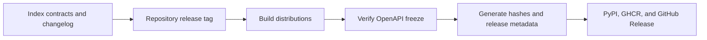

# Release and Versioning

`bijux-canon-index` derives its version from the repository-wide
`v<version>` tag through Hatch VCS. A release binds Python contracts, the
frozen HTTP schema, backend capability claims, artifact semantics, and replay
behavior to the same source commit.



## What constitutes an index release change

| Changed surface | Release significance |
| --- | --- |
| model, request, result, or root import | Python contract change |
| module CLI option or structured output | automation contract change |
| HTTP route, envelope, or schema | frozen v1 API change |
| metric, tie rule, score, rank, or exact runner | retrieval semantics change |
| ANN profile, parameter, witness, or rescoring | approximation contract change |
| artifact or plan fingerprint inputs | identity and replay change |
| backend capability or optional extra | deployment compatibility change |
| ledger, cache, or stored run shape | persistence and migration change |

Record the caller-visible effect in
`packages/bijux-canon-index/CHANGELOG.md`. State whether stored artifacts and
run records remain readable, whether replay remains comparable, and which
backends are inside the supported v1 contract.

## Version and artifact guards

Untagged or dirty checkouts may resolve to development or local versions.
Publication rejects those versions unless explicitly permitted and verifies
that the built wheel and source distribution match the resolved release.

The package build also checks the OpenAPI freeze and prepares release metadata,
including distribution hashes. A schema diff, missing source tree, or mismatched
artifact version is a release failure even when a wheel file was created.

## Focused release evidence

```bash
make test PACKAGE=bijux-canon-index
make lint PACKAGE=bijux-canon-index
make quality PACKAGE=bijux-canon-index
make api PACKAGE=bijux-canon-index
make build PACKAGE=bijux-canon-index
```

Before approval, inspect the built distributions for the complete
`bijux_canon_index` source tree, `py.typed`, license, README, API freeze data,
and an unambiguous version. Confirm separately that optional backend claims are
covered by capability and conformance evidence; building the base wheel does
not prove a remote service or native library works.

## Public interface truth

The canonical wheel registers `bijux-canon-index`. Release validation exercises
its help, version, structured output, and failure exit status from the staged
wheel. The `bijux-vex` compatibility package preserves its historical command
but must delegate to the same canonical entry point.

The same staged package artifacts feed PyPI, GHCR release bundles, and GitHub
Release assets. GHCR is a custody surface for the release bundle, not another
vector execution implementation.

A release is incomplete if readers cannot tell whether a ranking change is
exact, approximate, incompatible, or merely a newly available backend.
