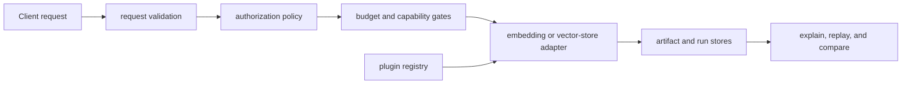

# Security and Safety

Index can ingest documents and vectors, load plugins, connect to vector stores,
persist run artifacts, and expose results over HTTP. Its execution contracts
govern retrieval semantics; deployment security still belongs to the hosting
application and backend configuration.

## Authority map

## Authorization posture

The runtime bootstrap supports allow-all and deny-all authorization modes. The
default is allow-all unless `BIJUX_CANON_INDEX_AUTHZ_MODE` selects `deny` or
`deny_all`. That switch is a package policy primitive, not user authentication
or tenant isolation. A network deployment must provide identity, per-operation
authorization, transport security, and audit controls outside the package.

Read-only mode can prevent mutation at configured boundaries. Enable it for
inspection and replay consumers that do not need corpus or artifact writes.

## Backend and credential safety

- Keep vector-store and embedding credentials in an approved secret mechanism,
  not in configuration files, URIs, traces, or command history.
- Pin backend, embedding provider, model, plugin, and protocol versions.
- Restrict state, cache, run, and artifact paths to the service identity.
- Treat imported corpus, index, artifact, and run files as untrusted until
  schema, fingerprint, dimensions, and ownership are validated.
- Review consistency and transaction semantics before claiming atomic ingest
  or replay equivalence across a remote backend.

Lineage records a redacted backend URI. If a custom adapter returns raw
credentials in metadata, that adapter violates the provenance boundary.

## Plugin execution

Plugins execute Python code in the index process. Install only reviewed,
pinned plugins from a controlled source. Registry discovery is not a sandbox,
and a timeout limits duration rather than filesystem, network, or process
authority. Run untrusted extensions in an isolated service boundary.

Plugin load failures, call timeouts, backend capability failures, and backend
unavailability remain separate so operators do not retry a malicious or
incompatible plugin as if it were a transient network fault.

## Resource and denial-of-service controls

Set ingest vector limits, maximum `top_k`, query-size limits, execution time,
memory, distance computations, ANN probes, candidate pool, index memory, and
search bounds. Approximate on-demand index construction can be substantially
more expensive than querying a prepared index; authorize and budget it
separately.

Low-signal refusal prevents weak approximate results from being presented as
useful neighbors. Witness sampling detects quality loss but consumes exact-work
budget. Neither control replaces application-level request quotas.

## Artifact and replay integrity

Run records use atomic file replacement, but filesystem atomicity does not
prove trusted origin. Protect artifact and run directories from cross-tenant
read/write access and retain fingerprints, plan identity, backend metadata,
and randomness declarations.

Replay must refuse changed indexes, parameters, or non-replayable randomness
when strict comparison is requested. Never weaken a replay refusal to make an
operational dashboard green; retain the refusal as the accurate safety result.
