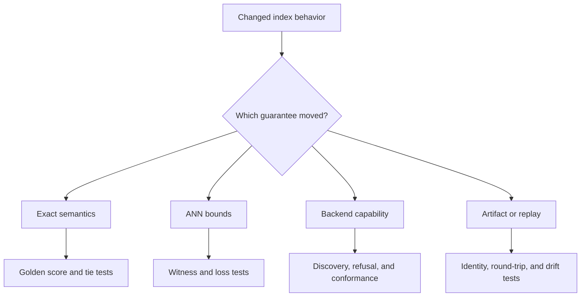

# Change Validation

Validate index changes against the execution promise that moved. The same
neighbor list can conceal a different metric, artifact, backend, budget,
approximation profile, or replay posture, so final identifiers alone are weak
evidence.



## Risk-to-evidence matrix

| Risk | Required focused evidence |
| --- | --- |
| metric meaning changes | fixed-vector scores, ordering, edge cases, and explicit version impact |
| ties become unstable | permutation fixtures proving the declared secondary order |
| ANN exceeds its contract | seeded corpus, sampled exact witness, recall/error assertion, and refusal case |
| exact rescoring is skipped | candidate and final-score evidence showing which stage ranked each result |
| unsupported backend is selected | capability discovery and strict refusal tests |
| dimension or metric mismatch is coerced | adapter-level rejection with stable failure class |
| artifact identity drifts | canonical materialization and fingerprint canary |
| tenant or run state leaks | isolated ledgers, paths, caches, and list/query tests |
| replay accepts incompatible state | corpus, policy, backend, parameter, and randomness mismatch fixtures |
| plugin registration diverges | entry-point discovery, duplicate-name, contract-version, and conformance tests |
| API freeze drifts | generated-versus-checked-in schema comparison and request contract tests |

## Select the narrowest useful command

```bash
packages/bijux-canon-index/.venv/bin/python -m pytest \
  packages/bijux-canon-index/tests/<area>/<test-file>.py -q

make test PACKAGE=bijux-canon-index
```

Add only the affected boundary lanes:

```bash
make api PACKAGE=bijux-canon-index
make lint PACKAGE=bijux-canon-index
make quality PACKAGE=bijux-canon-index
make build PACKAGE=bijux-canon-index
make docs-check
```

For backend work, run the adapter's conformance evidence in an environment that
actually supplies the capability. A skipped optional-backend test proves
nothing about the adapter. Record unavailable infrastructure honestly instead
of treating import success as conformance.

## Compare complete executions

Retain request, plan, artifact, capability report, backend identity, result,
cost, witness, and replay diff for a representative case. Compare exact and ANN
paths only under a declared approximation contract. Unexpected equality is not
proof that approximation disappeared; unexpected divergence is not acceptable
without a bounded explanation.

Update capability, limitation, and release documentation whenever a supported
backend, execution mode, artifact version, or replay condition changes.

Validation is sufficient when a reviewer can identify the moved retrieval
guarantee, reproduce the nearest proof, and distinguish strict refusal from an
empty or low-quality result.
