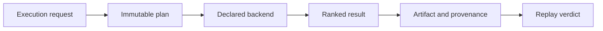

# Release Acceptance

An index change is releasable when a reviewer can connect execution intent to
backend capability, ranked output, provenance, and replay behavior. Returning
plausible neighbors is not acceptance evidence by itself.

## Acceptance record

| Changed surface | Required evidence | Release-blocking result |
| --- | --- | --- |
| scoring, metric, or tie order | focused scoring fixtures and cross-backend exact conformance | equal inputs inherit incidental backend order |
| execution request or plan | ABI, immutability, normalization, and fingerprint comparison | materially different intent shares an execution identity |
| exact backend | capability declaration plus deterministic CRUD/query conformance | an exact claim produces unstable ranked output |
| ANN backend | exact baseline diff, randomness record, parameters, seed behavior, and witness | approximation is presented without its loss or randomness boundary |
| budget enforcement | refusal and partial-result scenarios for each budget dimension | a breached budget is reported as complete success |
| artifact or run lifecycle | incomplete, failed, complete, corrupt, migration, and portability fixtures | an unfinalized or corrupt run loads as complete |
| replay | stored baseline, provenance join, golden comparison, and changed-input refusal | drift is relabeled as a match or omitted |
| public boundary | DTO, authorization, idempotency, schema, and error-contract evidence | HTTP or CLI output changes domain meaning |

## Backend-specific custody

Retain the dataset and vector identities, request, immutable plan, backend name
and version, capability descriptor, parameters, randomness profile, budget,
ranked output, provenance ledger, and lifecycle state. External ANN indexes or
remote databases require their own snapshot or durable identity; a portable
JSON record does not contain those systems.

## Release decision

- Exact evidence supports equality only for the recorded contract and
  numerical environment.
- ANN evidence supports declared approximation and replay interpretation, not
  exact equality.
- Conformance supports a shared protocol, not identical ranking across every
  backend.
- Performance evidence is comparable only with dataset, backend, parameters,
  dependency versions, and hardware held visible.

Use [change validation](change-validation.md) for evidence routing and
[known limitations](known-limitations.md) for the boundaries that remain after
acceptance.
