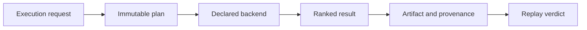

# Release Acceptance

An index change is releasable when a reviewer can connect execution intent to
backend capability, ranked output, provenance, and replay behavior. Returning
plausible neighbors is not acceptance evidence by itself.

## Acceptance record

| Changed surface | Required evidence | Release-blocking result |
| --- | --- | --- |
| scoring, metric, or tie order | focused scoring fixtures and cross-backend exact conformance | equal inputs inherit incidental backend order |
| execution request or plan | ABI, immutability, normalization, and fingerprint comparison | materially different intent shares an execution identity |
| exact backend | capability declaration plus deterministic CRUD/query conformance | an exact claim produces unstable ranked output |
| ANN backend | exact baseline diff, randomness record, parameters, seed behavior, and witness | approximation is presented without its loss or randomness boundary |
| budget enforcement | refusal and partial-result scenarios for each budget dimension | a breached budget is reported as complete success |
| artifact or run lifecycle | incomplete, failed, complete, corrupt, migration, and portability fixtures | an unfinalized or corrupt run loads as complete |
| replay | stored baseline, provenance join, golden comparison, and changed-input refusal | drift is relabeled as a match or omitted |
| public boundary | DTO, authorization, idempotency, schema, and error-contract evidence | HTTP or CLI output changes domain meaning |

## Keep execution verdicts separate

Vector execution crosses several independently reviewable decisions. A release
record must preserve the strongest state actually reached:

| State | Required evidence | Stronger claim still unavailable |
| --- | --- | --- |
| admissible | normalized request, intent, mode, contract, budget, and capability match | the backend executed the request |
| executed | backend identity, parameters, input fingerprint, ranked output, cost, warnings, and refusal status | the result was durably finalized |
| finalized | complete artifact lifecycle, provenance ledger, fingerprints, and native-state reference | replay produces an acceptable comparison |
| replay compared | original and candidate envelopes, policy, structured diff, verdict, and reason | equivalence outside the declared policy |
| portable | isolated reader or import test plus every referenced external snapshot or durable identifier | another backend will rank identically |

An `ExecutionArtifact` in a complete state proves only what its envelope and
provenance retain. If the native ANN index, remote collection, embedding model,
or dataset snapshot is external, portability and replay remain conditional on
that external identity being available.

## Release comparison set

Select fixtures that expose the algorithmic and lifecycle edges affected by
the change:

1. one exact request with ties, stable ordering, and a known result;
2. one bounded or approximate request compared with its exact baseline;
3. one unsupported-capability or budget refusal;
4. one incomplete or corrupt artifact that must not load as complete;
5. one replay with no disallowed drift and one with a single blocking drift;
6. one alternate eligible backend for the shared conformance boundary; and
7. one public-interface request whose error retains the domain failure class.

The exact, ANN, conformance, provenance, execution-diff, misuse, and API/CLI
suites each defend a different part of this set. Report which fixture supports
which claim; a large passing count without request, backend, and artifact
identity is not an interpretable release record.

## Backend-specific custody

Retain the dataset and vector identities, request, immutable plan, backend name
and version, capability descriptor, parameters, randomness profile, budget,
ranked output, provenance ledger, and lifecycle state. External ANN indexes or
remote databases require their own snapshot or durable identity; a portable
JSON record does not contain those systems.

## Release decision

- Exact evidence supports equality only for the recorded contract and
  numerical environment.
- ANN evidence supports declared approximation and replay interpretation, not
  exact equality.
- Conformance supports a shared protocol, not identical ranking across every
  backend.
- Performance evidence is comparable only with dataset, backend, parameters,
  dependency versions, and hardware held visible.

Use [change validation](change-validation.md) for evidence routing and
[known limitations](known-limitations.md) for the boundaries that remain after
acceptance.
