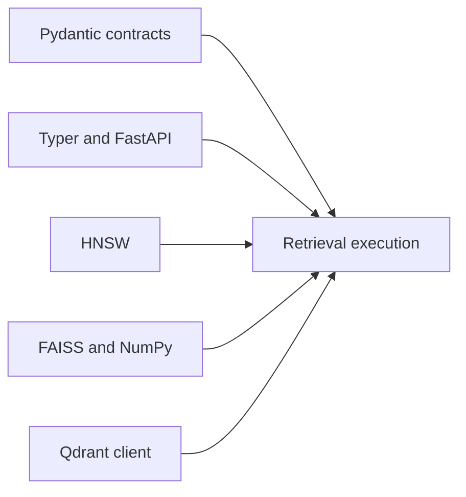

# Backend Dependency Authority

Index dependencies can alter validation, ranking, persistence, transport, or
replay. Optional backends remain outside the stable claim until their declared
capabilities and retained identity pass the relevant conformance gates.

## Dependency classes

| Boundary | Authority introduced | Evidence required when it changes |
| --- | --- | --- |
| Pydantic | request validation, DTO serialization, and compatibility acceptance | invalid/extra-field matrix, snapshots, and fingerprint comparison |
| Typer and FastAPI | command/HTTP parsing, errors, OpenAPI, and idempotency boundary | focused CLI/API flows and schema freeze |
| HNSW | approximate construction, query parameters, randomness, and native state | ANN conformance, exact baseline diff, drift, and replay refusal |
| FAISS and NumPy | vector dtype, metric behavior, native index, and numerical results | dimension/metric tests, native round trip, and ranked comparison |
| Qdrant client | remote protocol, service capability, retries, tenancy, and persistence | adapter conformance, failure injection, isolation, and service identity |
| PyYAML configuration extra | configuration parsing and scalar interpretation | valid/invalid fixtures and normalized plan comparison |

## Admission rules

- A backend version is recorded with artifacts used for replay or comparison.
- Capability is observed through conformance, not trusted from an adapter
  label.
- A native or remote format change has an explicit migration or refusal path.
- Numerical dependency changes compare rankings and fingerprints, not only
  installation.
- Remote clients do not transfer responsibility for authentication, transport
  security, tenant configuration, backup, or service availability into the
  package.

Core dependency audits identify known advisories and resolution conflicts.
Optional backend evidence additionally needs the environment in which the
backend actually runs; an uninstalled extra cannot establish conformance.

## Promote a backend dependency with evidence

Evaluate an optional backend against the exact baseline in the same corpus and
metric. Retain package and native-library versions, platform/CPU identity,
backend configuration, capability probe, build seed and randomness contract,
index fingerprint, request, ranked output, cost record, and failure results.

| Backend class | Admission evidence | Refusal evidence |
| --- | --- | --- |
| exact in-memory | dtype/dimension/metric matrix, stable tie order, empty and duplicate vectors, exact baseline digest | non-finite values, unsupported metric, dimension mismatch, or unstable tie semantics |
| HNSW | construction/query parameters, declared randomness, recall against exact, witness behavior, saved-state round trip | undeclared variance, recall below the declared threshold, corrupt native state, or incompatible parameters |
| FAISS | native build identity, dtype/metric mapping, serialization round trip, exact/approximate classification | unavailable native capability, changed ordering outside the envelope, or unreadable persisted index |
| Qdrant | server/client identity, collection schema, tenant boundary, consistency posture, retries, failure injection, and result provenance | redacted-but-untraceable endpoint, collection mismatch, partial mutation, ambiguous timeout, or unavailable service |
| plugin backend | distribution and entry-point identity, declared capability, isolation posture, timeout/failure mapping, conformance suite | undeclared authority, contract translation, process escape assumption, or swallowed plugin failure |

An adapter is admitted only for the capabilities actually observed. Success on
query does not admit mutation, persistence, replay, tenancy, or approximation;
each capability needs its own positive and refusal cases.

## Compare dependency changes at three layers

First compare contract behavior: validation, plans, typed failures, and public
serialization. Then compare retrieval behavior: ranked identities, scores,
ties, approximation, resource cost, and provenance. Finally compare operational
behavior: native state, remote transactions, retries, interruption, and replay.
A clean result at one layer cannot waive a difference at another.

Store the declared tolerance or recall threshold before running the comparison.
Changing it after observing a favorable result creates a new acceptance rule
and requires a new evidence record.

Use [test strategy](test-strategy.md) for adapter and replay gates and
[risk register](risk-register.md) for the residual native and remote-service
boundary.
