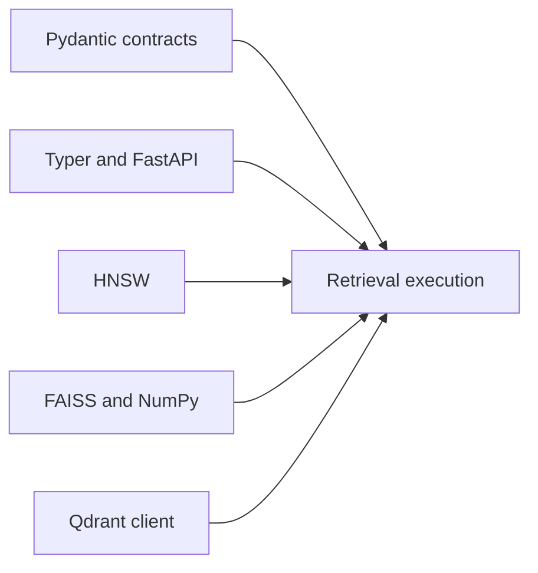

# Backend Dependency Authority

Index dependencies can alter validation, ranking, persistence, transport, or
replay. Optional backends remain outside the stable claim until their declared
capabilities and retained identity pass the relevant conformance gates.

## Dependency classes

| Boundary | Authority introduced | Evidence required when it changes |
| --- | --- | --- |
| Pydantic | request validation, DTO serialization, and compatibility acceptance | invalid/extra-field matrix, snapshots, and fingerprint comparison |
| Typer and FastAPI | command/HTTP parsing, errors, OpenAPI, and idempotency boundary | focused CLI/API flows and schema freeze |
| HNSW | approximate construction, query parameters, randomness, and native state | ANN conformance, exact baseline diff, drift, and replay refusal |
| FAISS and NumPy | vector dtype, metric behavior, native index, and numerical results | dimension/metric tests, native round trip, and ranked comparison |
| Qdrant client | remote protocol, service capability, retries, tenancy, and persistence | adapter conformance, failure injection, isolation, and service identity |
| PyYAML configuration extra | configuration parsing and scalar interpretation | valid/invalid fixtures and normalized plan comparison |

## Admission rules

- A backend version is recorded with artifacts used for replay or comparison.
- Capability is observed through conformance, not trusted from an adapter
  label.
- A native or remote format change has an explicit migration or refusal path.
- Numerical dependency changes compare rankings and fingerprints, not only
  installation.
- Remote clients do not transfer responsibility for authentication, transport
  security, tenant configuration, backup, or service availability into the
  package.

Core dependency audits identify known advisories and resolution conflicts.
Optional backend evidence additionally needs the environment in which the
backend actually runs; an uninstalled extra cannot establish conformance.

Use [test strategy](test-strategy.md) for adapter and replay gates and
[risk register](risk-register.md) for the residual native and remote-service
boundary.
