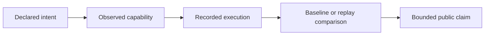

# Public Claim Standards

Retrieval claims name the execution contract that produced them. Terms such as
exact, deterministic, approximate, replayable, portable, and bounded are not
interchangeable descriptions of a successful query.

## Claim vocabulary

| Public wording | Evidence required | Bound on the claim |
| --- | --- | --- |
| deterministic exact retrieval | exact-capable backend, stable plan, metric, tie order, and matching fingerprints | applies to the recorded artifact and environment |
| bounded ANN retrieval | exact baseline, approximation report, runner parameters, randomness, and budget | permits only the declared loss and variance |
| replayable execution | retained baseline, artifact identity, backend fingerprint, request, and replay policy | can refuse when required identity is unavailable |
| backend conformance | common CRUD, query, transaction, isolation, and provenance cases | does not promise identical ranking across implementations |
| portable artifact | canonical version, migration path, fingerprints, and load test | excludes unbundled remote databases and native ANN files |
| complete run | finalized lifecycle with consistent ledger, artifacts, and result | individual atomic writes are not a distributed transaction |
| enforced budget | visible refusal or partial classification for measured contract counters | is not an operating-system wall-clock or memory limit |

## Comparison evidence

A performance or quality comparison identifies the dataset, vector model,
metric, backend and version, construction/query parameters, seed or randomness
boundary, dependency versions, hardware, recall or loss measure, and latency
measure. Removing any of these turns a comparison into an anecdote.

Provenance establishes how a result was produced. It does not establish that
the corpus is correct, the embedding is suitable, or the returned material is
sufficient for a scientific conclusion.

## Interface language

Public examples distinguish the canonical Python and HTTP contracts from
compatibility commands. A checked-in OpenAPI document is described as a frozen
contract; availability and deployment security require live evidence.

See [invariants](invariants.md) for execution laws and
[risk register](risk-register.md) for persistent backend and replay exposure.
