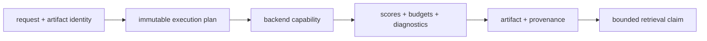

# Interpreting Retrieval Evidence

A retrieval result is meaningful only with the contract, artifact, backend,
budget, approximation boundary, and provenance that produced it. A plausible
neighbor list without those records cannot establish exactness, replayability,
or even that the requested policy was honored.



## Read One Retrieval Verdict

| Review question | Evidence to inspect | Unsafe shortcut |
| --- | --- | --- |
| Which corpus and vectors were searched? | artifact identity, vector contract, corpus and embedding fingerprints | relying on a backend collection name |
| Which behavior was requested? | execution request, determinism class, metric, `top_k`, filters, budgets | inferring policy from returned fields |
| Why was this backend eligible? | capability registry entry and resolved plan | treating successful connection as conformance |
| Was the result exact? | exact execution path, stable tie ordering, matching plan and artifact fingerprints | assuming deterministic because a seed exists |
| Was approximation bounded? | exact baseline, ANN parameters, randomness record, witness, recall or loss bound | reporting latency without quality loss |
| Is the run complete? | result record followed by the `complete` lifecycle marker | accepting an individually valid JSON file |
| Can it be replayed? | retained request, artifact, backend fingerprint, environment and replay policy | reconstructing from current backend state |

## Bounded Retrieval Vocabulary

| Claim | Required evidence | Bound on the claim |
| --- | --- | --- |
| deterministic exact retrieval | exact-capable backend, stable plan, metric, tie order, and matching fingerprints | applies to the recorded artifact and environment |
| bounded ANN retrieval | exact baseline, approximation report, runner parameters, randomness, and budget | permits only declared loss and variance |
| replayable execution | retained baseline, artifact identity, backend fingerprint, request, and replay policy | must refuse when required identity is unavailable |
| backend conformance | shared CRUD, query, transaction, isolation, and provenance cases | does not promise identical rankings across implementations |
| portable artifact | canonical version, migration path, fingerprints, and load test | excludes unbundled remote databases and native ANN files |
| complete run | finalized lifecycle with consistent ledger, artifacts, and result | individual atomic writes are not a distributed transaction |
| enforced budget | visible refusal or partial classification for measured counters | is not an operating-system time or memory limit |

## Compare Results Without Hiding Drift

A performance or quality comparison binds dataset, vector model, metric,
backend and version, construction and query parameters, seed or randomness
boundary, dependency versions, hardware, recall or loss measure, and latency
measure. If one changes, the comparison describes another execution context.

Score values are meaningful only within their metric and implementation.
Cross-backend conformance does not require identical floating-point results or
rank order. A faster approximate result with lower recall is a different
tradeoff, not an unqualified improvement.

## Evaluate The Installed Retriever

`PublicRetrievalEvaluationRequest` contains an immutable index artifact,
unique reviewed questions, and question-specific graded qrels. It deliberately
has no ranked-hit field. `PublicRetrievalEvaluator` invokes its installed
retrieval executor once per question and counts insufficient, refused, and
failed executions in the same unique-query denominator as successful results.

The report retains generation, model, configuration, Runtime run, VEX, raw
rank, score, content hash, and exact locator-segment lineage for every observed
hit. It reports per-query Recall@5, reciprocal rank at 10, and nDCG@10; macro
samples and confidence intervals; pooled relevant-qrel arithmetic; refusal and
failure counts; and the five worst query identities. Metadata coverage or a
caller-authored ranking cannot satisfy this boundary.

For a configured Runtime workspace and persisted index artifact:

```console
bijux-canon-runtime v2 evaluate-retrieval \
  --cases examples/ancient-dna-research/truth/evaluation-cases.jsonl \
  --qrels examples/ancient-dna-research/truth/qrels.jsonl \
  --index-id sha256:INDEX_ARTIFACT \
  --split development \
  --mode local-hybrid-ann
```

Use `--human` for the bounded operator summary. JSON is the stable evidence
record. Held-out cases intentionally omit labels and are refused by this
development interface; only the separately authorized release evaluator may
join and aggregate the sealed held-out truth.

## Separate Provenance From Relevance

Provenance establishes how the engine admitted and produced a candidate. It
does not establish that upstream vectors represent the domain, the corpus is
complete, or the candidate supports a downstream claim. That decision belongs
to the evidence and reasoning boundary using the retained candidate identity.

Continue with [invariants](invariants.md) for enforced execution laws,
[known limitations](known-limitations.md) for backend and deployment bounds,
and the [risk register](risk-register.md) for failure signals and controls.
