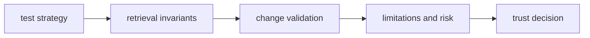

# Quality

Open this section when you need to decide whether retrieval behavior is proven strongly enough for callers and downstream packages to trust replay, provenance, and search results.

## Trust Model

The quality story for index has to explain why retrieval results are more than
plausible output. Reviewers need to see how replay, provenance, and search
behavior are constrained, what proof backs them, and where the remaining trust
limits still sit.

## Read These First

- open [Test Strategy](https://bijux.io/bijux-canon/03-bijux-canon-index/quality/test-strategy/) first when you need the broad proof shape behind retrieval behavior
- open [Invariants](https://bijux.io/bijux-canon/03-bijux-canon-index/quality/invariants/) when the question is what must not drift across search and replay behavior
- open [Change Validation](https://bijux.io/bijux-canon/03-bijux-canon-index/quality/change-validation/) when you need the minimum proof for a safe index change

## Trust Risk

The main quality risk here is green tests that still allow replay or provenance meaning to drift unnoticed.

## First Proof Check

- `tests` and package-local validation surfaces for executable evidence
- invariants, limitations, and risk pages for the trust boundaries that still matter after green checks
- release notes and caller-facing docs when the change alters what readers may safely assume

## Pages In This Section

- [Test Strategy](https://bijux.io/bijux-canon/03-bijux-canon-index/quality/test-strategy/)
- [Invariants](https://bijux.io/bijux-canon/03-bijux-canon-index/quality/invariants/)
- [Review Checklist](https://bijux.io/bijux-canon/03-bijux-canon-index/quality/review-checklist/)
- [Documentation Standards](https://bijux.io/bijux-canon/03-bijux-canon-index/quality/documentation-standards/)
- [Definition of Done](https://bijux.io/bijux-canon/03-bijux-canon-index/quality/definition-of-done/)
- [Dependency Governance](https://bijux.io/bijux-canon/03-bijux-canon-index/quality/dependency-governance/)
- [Change Validation](https://bijux.io/bijux-canon/03-bijux-canon-index/quality/change-validation/)
- [Known Limitations](https://bijux.io/bijux-canon/03-bijux-canon-index/quality/known-limitations/)
- [Risk Register](https://bijux.io/bijux-canon/03-bijux-canon-index/quality/risk-register/)

## Leave This Section When

- leave for [Foundation](https://bijux.io/bijux-canon/03-bijux-canon-index/foundation/) when the doubt is really about package ownership rather than proof
- leave for [Interfaces](https://bijux.io/bijux-canon/03-bijux-canon-index/interfaces/) when the question is what the contract is rather than whether it is defended
- leave for [Operations](https://bijux.io/bijux-canon/03-bijux-canon-index/operations/) when the package already seems trustworthy and the real issue is how to run it repeatably

## Design Pressure

If replay and provenance trust are treated as side effects of passing tests,
the package will look stronger than it is. This section has to keep proof,
drift boundaries, and known limits visibly connected.
