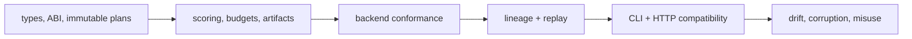

# Quality

Index quality is layered: algorithm correctness, backend conformance,
provenance completeness, replay behavior, and interface compatibility are
separate claims. Plausible neighbors prove none of them on their own.

## Evidence chain

```mermaid
flowchart LR
    core["types, ABI, immutable plans"]
    domain["scoring, budgets, artifacts"]
    adapter["backend conformance"]
    provenance["lineage + replay"]
    boundary["CLI + HTTP compatibility"]
    adversarial["drift, corruption, misuse"]

    core --> domain --> adapter --> provenance --> boundary --> adversarial
```

## Claims and proof

| Trust claim | Required evidence | Important limit |
| --- | --- | --- |
| exact execution is stable | scoring, tie-order, plan-identity, deterministic conformance, golden replay | numerical platform differences still require recorded comparison |
| an adapter honors the common contract | adapter unit tests plus CRUD, transaction, isolation, and query conformance | conformance does not require identical cross-backend ranking |
| ANN loss is bounded and visible | exact baseline diff, witness, budget, parameter, and replay tests | a seed controls only randomness honored by the runner |
| provenance explains a result | full explanation join and provenance stability gate | provenance does not establish semantic relevance |
| artifacts are portable | canonical-version, migration, fingerprint, and portability tests | external database or ANN binaries are not bundled automatically |
| runs have honest lifecycle | incomplete/failed/complete and corruption tests | individual atomic file writes are not distributed transactions |
| public interfaces remain compatible | v0.1 snapshots, OpenAPI freeze, CLI flows, error and idempotency tests | implemented modules can remain intentionally outside v1 |
| resource policy is enforced | budget and partial-result scenarios | current latency/memory measures are estimates and counters, not OS limits |

## Adversarial posture

The suite explicitly exercises corrupt artifacts, dishonest capability
declarations, cross-run leakage, transaction misuse, authorization denial,
stale metadata, missing ANN support, parameter drift, and replay against
changed inputs. These cases defend the trust boundary more directly than
additional happy-path searches.

Benchmark results are regression evidence only when dataset, backend,
parameters, dependency versions, and hardware are retained. Lower latency with
changed recall or approximation evidence is a different result, not a simple
improvement.

## Match proof to execution posture

Do not evaluate every vector run with the same assurance argument:

| Execution posture | Evidence required | Refuse the claim when |
| --- | --- | --- |
| strict exact | exact-capable backend, stable metric/tie order, immutable artifact, zero disallowed replay diff | fallback, approximation, truncation, or parameter drift occurred |
| bounded approximation | exact baseline, declared loss/resource budgets, runner witness, observed recall/error and cost | the bound was inferred after execution or the witness is missing |
| exploratory | declared exploratory intent, complete provenance, warnings and retained candidates | output is promoted to an exact or reproducible result |
| plugin-backed | capability declaration, registration identity, conformance suite and backend-specific negative cases | discovery success is the only compatibility evidence |
| cross-backend comparison | identical input/request identity, normalized score meaning, both artifacts and explicit tolerance | ranked lists are compared without metric or capability equivalence |
| replay | original artifact and policy, current environment/capabilities, semantic diff, verdict and reason | a matching seed or overlapping neighbors is the only comparison |

The strongest valid statement is bounded by the weakest retained part of the
execution envelope. For example, exact scoring with unknown corpus identity is
not an exact retrieval claim, and complete provenance with an unmeasured ANN
witness is not evidence that approximation stayed within budget.

## Evidence routes

| Need | Guide |
| --- | --- |
| Understand ownership across the suite | [Test strategy](test-strategy.md) |
| Review execution and replay laws | [Invariants](invariants.md) |
| Select proof for a concrete change | [Change validation](change-validation.md) |
| Apply consistent review questions | [Review checklist](review-checklist.md) |
| Decide whether a change is releasable | [Definition of done](definition-of-done.md) |
| Govern optional backends and providers | [Dependency governance](dependency-governance.md) |
| Understand approximation, budget, persistence, and security limits | [Known limitations](known-limitations.md) |
| Inspect unresolved technical and operational risk | [Risk register](risk-register.md) |
| Interpret retrieval verdicts without hiding approximation or drift | [Interpreting retrieval evidence](evidence-interpretation.md) |

A regression belongs first at the layer that made the false claim. Add
conformance proof when another backend could repeat it, and golden replay proof
when artifact or fingerprint identity changes.
