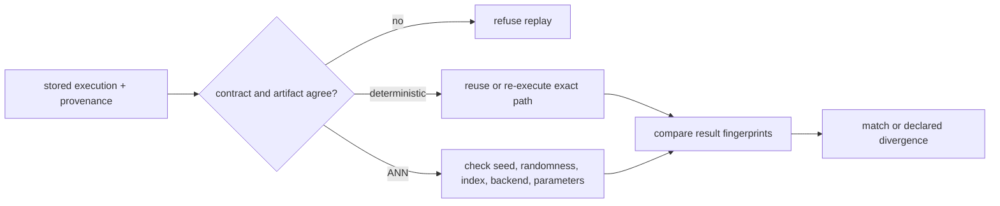

# Invariants

`bijux-canon-index` treats retrieval as a declared execution, not an opaque
nearest-neighbor call. The request, artifact, backend capabilities, result
order, and provenance must agree before an outcome can be called replayable.

## Execution invariants

| Identifier | Guarantee | Refusal condition |
| --- | --- | --- |
| `INV-010` | artifact and request use the same execution contract | deterministic and non-deterministic contracts are mixed |
| `INV-020` | non-deterministic execution declares an execution budget/randomness boundary | approximate execution is requested without the required declaration |
| `INV-040` | replay has a stored prior execution for the artifact | the provenance ledger has no baseline result |
| `INV-041` | non-deterministic replay retains randomness annotations | the recorded plan has no randomness labels |

A deterministic request forbids a randomness profile and requires a vector
store that declares deterministic exact behavior. A non-deterministic request
requires ANN support and an explicit randomness profile when the execution
path requires one. A replayable ANN path also requires a seed when the runner
supports seeding; otherwise the request must identify its randomness sources
and declare that it is non-replayable.

## Artifact identity

Execution artifacts bind retrieval to the corpus, vectors, index
configuration, and execution contract. Result records carry fingerprints for
those inputs together with backend and determinism fingerprints. These values
let a reviewer distinguish three different events:

- the same request executed against the same material;
- a replay performed after an artifact, backend, or parameter change;
- an intentionally approximate execution whose result may diverge within its
  declared boundary.

Canonical serialization is used before fingerprinting. Mapping key order or
incidental JSON formatting therefore does not create a different identity,
while a meaningful request or artifact change does.

## Result and budget invariants

- Vector dimensions must agree at the execution boundary.
- Stable tie-breaking prevents equal scores from inheriting backend iteration
  order.
- Execution plans are immutable values and remain declarative until resources
  are attached.
- Authorization, transaction, and read-only contracts are checked before the
  corresponding mutation or execution.
- A budget breach is visible as a refusal or partial outcome with a dimension
  and any retained partial results; it is not silently reported as complete.
- Backend descriptors are claims that are tested. A backend that behaves
  contrary to its determinism or capability declaration is rejected.

## Replay semantics

For deterministic replay, different result fingerprints are a mismatch. For a
non-deterministic contract, divergence is recorded rather than relabeled as an
exact match. Strict ANN replay additionally refuses changes to the index hash,
algorithm, backend name/version, or index parameters when those values are
available.

The [test strategy](test-strategy.md) identifies the conformance and replay
gates that exercise these guarantees across backends.
