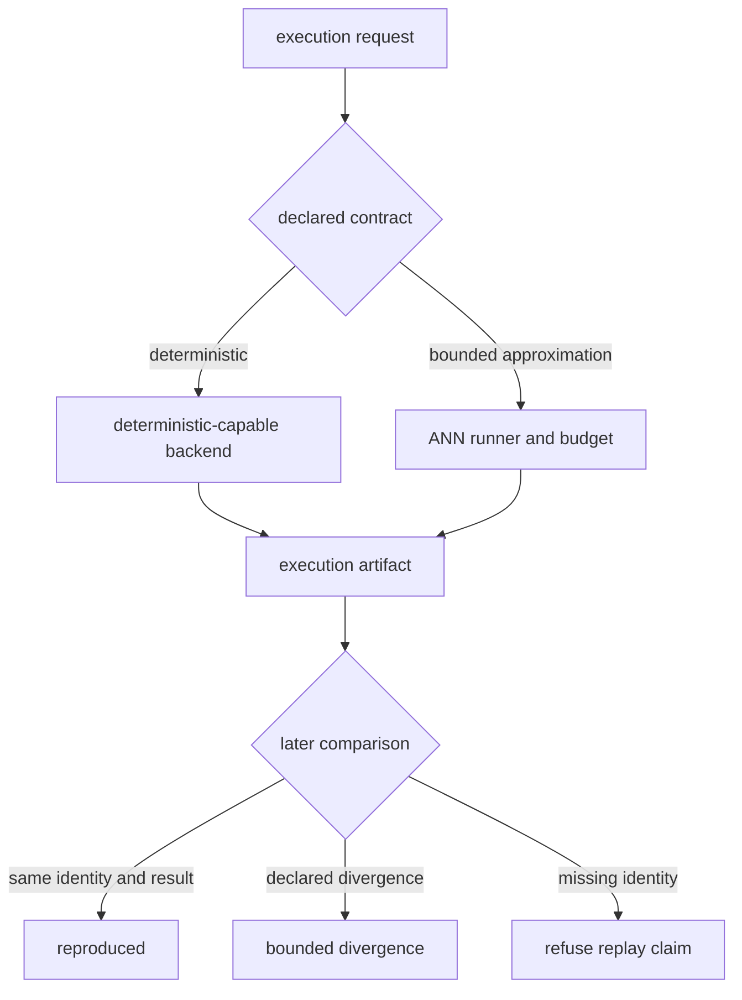

# Known Limitations

`bijux-canon-index` can prove which retrieval contract was requested, which
capability was selected, and which artifact was retained. It cannot turn an
approximate search into an exact one, certify upstream vectors, or freeze a
remote service that changes outside the run.

## Exactness, Determinism, And Replay

These terms are deliberately different:

| Claim | Package meaning | Important exclusion |
| --- | --- | --- |
| deterministic execution | the request uses a backend and scoring path classified as deterministic, with canonical ordering and recorded identity | it does not certify that upstream vectors were generated deterministically |
| replayable artifact | the artifact contains the identity needed by the declared execution contract | it does not bundle an external database, model, ANN binary, or service snapshot |
| bounded approximation | approximation sources and limits are declared and recorded | it does not promise the same neighbors as exact search |
| cross-backend conformance | adapters obey the common transaction, isolation, and query contracts | it does not promise identical floating-point scores or ranking across every backend and build |

A seed governs only randomness consumed by the selected implementation. Library
version, compiler flags, hardware, thread scheduling, index build order, and
remote state can still change ANN output. Strict replay must refuse an equality
claim when that identity is unavailable.

## Resource Budgets Are Contract Proxies

Vector, distance-computation, and ANN-probe limits are counters the engine can
reason about directly. Latency and memory fields are checked through execution
estimates and deterministic proxies. They are not operating-system wall-clock
deadlines, resident-set-size limits, container quotas, or protection against a
backend process exhausting its own resources.

Use infrastructure controls for hard CPU, time, memory, network, and storage
ceilings. Treat the package budgets as reproducible planning and classification
evidence. A result classified as partial or refused because of a budget must not
be relabeled as an ordinary top-`k` result.

## Backend And Persistence Boundaries

| Surface | Supported boundary | Outside the boundary |
| --- | --- | --- |
| in-memory and SQLite stores | local conformance, deterministic transactions, run isolation | multi-host consensus, service failover, cross-process cache coherence |
| FAISS and HNSW adapters | optional local ANN integration when the dependency is installed | invariant ranking across native builds, architectures, or thread settings |
| Qdrant integration | adapter-level capability and metadata handling | service availability, tenancy, backups, rolling-upgrade equivalence |
| filesystem `RunStore` | atomic replacement of each JSON record and explicit lifecycle status | one atomic transaction spanning metadata, result, status, native index files, and remote state |
| execution artifact | canonical package-owned execution record | archive of external indexes, plugins, secrets, or model assets |

Remote backends, asynchronous service orchestration, streaming search, and a
frozen pgvector contract are not part of the stable surface. Optional code being
importable is not evidence that a feature belongs to the supported contract.

## Interface Boundary

The package exposes Python and HTTP surfaces and contains a Typer application,
but it does not install a `bijux-canon-index` console command. Automation must
not assume that command exists. The `bijux-vex` package is a compatibility
surface with its own continuity constraints; it is not the name of the
canonical index contract.

Authorization decisions and metadata redaction apply only at package-owned
interfaces. Authentication, TLS, secret management, service-to-service
identity, tenant configuration, and backend access control belong to the host.
Execution artifacts should contain identifiers and decisions, never credentials
or unrestricted vector payloads.

## Runtime Composition Boundary

Runtime's live retrieval path asks the `bijux_canon_index` package root for
`enforce_contract(vector_contract_id, evidence)` and interprets its return as a
Boolean verdict. The canonical root exports version metadata only and provides
no callable with that contract.

Index's native decision is richer than a Boolean: request validation, artifact
identity, backend capability, budget accounting, approximation evidence,
provenance, partial results, and typed refusal all affect the result. A durable
runtime adapter must preserve that record rather than collapse it into an
unexplained `True` or `False`. The `bijux-vex` compatibility root mirrors the
canonical package and does not supply the missing integration.

## Interpreting Retrieval Quality

Contract correctness means the engine honored the plan. It does not mean the
embedding space represents the domain, the corpus contains the answer, or the
returned neighbors justify a conclusion. Establish quality with a versioned
evaluation corpus, an exact baseline, declared relevance metrics, and the same
backend identity used in production.

See the [risk register](risk-register.md) for failure signals and response
controls, and the [test strategy](test-strategy.md) for executable evidence.
