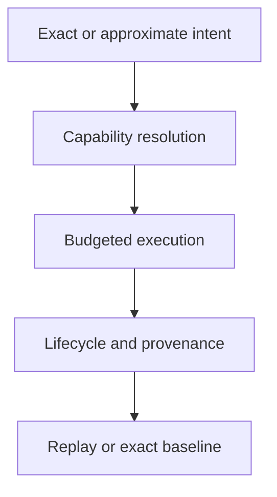

# Retrieval Review

Review begins with execution intent and ends with the evidence needed to
interpret replay. Each answer must be visible in contracts or artifacts rather
than inferred from a backend name.

## Audit one ranking decision

Choose a returned neighbor—preferably one involved in a tie or approximation—
and reconstruct the decision:

| Question | Evidence to follow |
| --- | --- |
| why was this request admissible? | normalized intent, mode, contract, budget, dimensions, metric, and authorization |
| why was this backend selected? | registry entry, observed capability descriptor, provider availability, and fallback record |
| which state was searched? | dataset, artifact, index, embedding, and backend-native snapshot identities |
| why did this item receive this position? | normalized vector, metric, score, stable tie key, filters, top-`k`, and ANN witness where applicable |
| what did execution cost or omit? | latency, memory, error/approximation budget, truncation, warnings, and partial status |
| can the result be compared later? | finalized artifact, provenance join, request and result fingerprints, replay policy, and external-state identity |

If the ranking can be explained only by naming the backend, the evidence is
insufficient. Backend names select implementations; they do not encode the
request, corpus, parameters, numerical environment, or loss boundary.

## Adversarial scenarios

| Scenario | Required behavior |
| --- | --- |
| equal scores arrive in different backend order | canonical tie ordering produces the same ranked result |
| preferred backend lacks a required capability | explicit refusal or a declared eligible fallback with visible identity |
| latency, memory, or error budget is exhausted | typed budget outcome; no complete-success classification |
| ANN seed or witness changes | new execution identity and a structured comparison against the exact or prior baseline |
| idempotency key is reused with different normalized intent | refusal before resource mutation |
| artifact says complete but ledger/native state is absent or corrupt | load and replay refusal with the missing boundary named |
| dataset or index identity changes during replay | blocking diff when the selected replay policy requires equality |
| compatibility command and canonical interface disagree | investigate canonical behavior and bridge delegation separately |

Run the scenario at the lowest owning layer first, then through the public
adapter when serialization, authorization, or error mapping is part of the
claim. A public smoke test alone cannot prove backend or replay semantics.

## Intent and plan

- Does the request declare exact or non-deterministic execution without
  contradictory fields?
- Are metric, dimensions, top-`k`, filters, budget, and randomness normalized
  into immutable plan identity?
- Can an idempotency key bind only to equivalent normalized intent?
- Are authorization and transaction constraints checked before resource use?

## Backend and ranking

- Does observed behavior agree with the backend capability descriptor?
- Is equal-score ordering stable across repeated runs?
- Does an ANN change include exact-versus-approximate comparison and a visible
  approximation witness?
- Are fallback and missing-capability paths explicit refusals rather than
  silent changes of algorithm?

## Persistence and replay

- Are incomplete, failed, and complete lifecycle states distinguishable?
- Do ledger entries, result fingerprints, artifacts, and native backend state
  describe the same execution?
- Does replay refuse changed dataset, index, backend, parameters, or randomness
  when the selected policy requires equality?
- Are acceptable and blocking diffs both retained rather than reduced to one
  boolean?

## Public and operational boundaries

- Do API models, error envelopes, authorization, and idempotency preserve
  domain meaning?
- Are vectors, service topology, credentials, and tenant details redacted from
  diagnostics where required?
- Do benchmark claims carry full comparison context?
- Is the canonical surface distinguished from `bijux-vex` compatibility?

Conclude with [release acceptance](definition-of-done.md) and compare residual
exposure with [known limitations](known-limitations.md).
