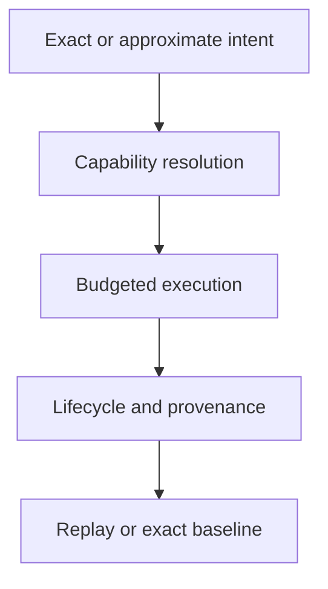

# Retrieval Review

Review begins with execution intent and ends with the evidence needed to
interpret replay. Each answer must be visible in contracts or artifacts rather
than inferred from a backend name.

## Intent and plan

- Does the request declare exact or non-deterministic execution without
  contradictory fields?
- Are metric, dimensions, top-`k`, filters, budget, and randomness normalized
  into immutable plan identity?
- Can an idempotency key bind only to equivalent normalized intent?
- Are authorization and transaction constraints checked before resource use?

## Backend and ranking

- Does observed behavior agree with the backend capability descriptor?
- Is equal-score ordering stable across repeated runs?
- Does an ANN change include exact-versus-approximate comparison and a visible
  approximation witness?
- Are fallback and missing-capability paths explicit refusals rather than
  silent changes of algorithm?

## Persistence and replay

- Are incomplete, failed, and complete lifecycle states distinguishable?
- Do ledger entries, result fingerprints, artifacts, and native backend state
  describe the same execution?
- Does replay refuse changed dataset, index, backend, parameters, or randomness
  when the selected policy requires equality?
- Are acceptable and blocking diffs both retained rather than reduced to one
  boolean?

## Public and operational boundaries

- Do API models, error envelopes, authorization, and idempotency preserve
  domain meaning?
- Are vectors, service topology, credentials, and tenant details redacted from
  diagnostics where required?
- Do benchmark claims carry full comparison context?
- Is the canonical surface distinguished from `bijux-vex` compatibility?

Conclude with [release acceptance](definition-of-done.md) and compare residual
exposure with [known limitations](known-limitations.md).
