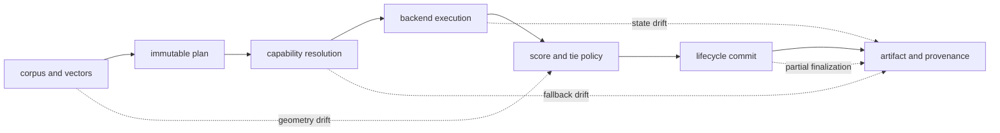

# Risk Register

Index owns the truth of an execution claim. A neighbor list is insufficient:
the request, vector geometry, capability decision, backend identity, budget,
ranking, lifecycle status, and artifact must describe one execution. Plausible
results assembled from mismatched generations are a high-severity failure.

## Trust Chain



## Persistent Risks

| Hazard | Severity | Detection signal | Required control | Residual owner |
| --- | --- | --- | --- | --- |
| vector dimension, metric, or normalization is mislabeled | critical | ingestion contract differs from plan or exact-baseline scores shift abruptly | bind dimension, metric, normalization, model identity, and corpus fingerprint to the plan | embedding producer |
| backend claims a capability it does not honor | critical | conformance probe or execution evidence contradicts the capability report | validate capability before execution; refuse dishonest or unsupported fallbacks | adapter owner |
| an ANN fallback is presented as exact | critical | artifact execution contract, approximation report, and selected backend disagree | require explicit fallback policy and retain the actual path | application owner |
| tie ordering or floating-point behavior drifts | high | result IDs change while scores are equal or near the tie threshold | canonical secondary ordering; compare score and result fingerprints | backend owner |
| native index or remote state drifts after planning | high | runner, vector, parameter, native-artifact, or service fingerprint changes | verify identity immediately before execution and replay; rebuild or refuse on mismatch | storage operator |
| estimated budget is treated as a hard resource limit | high | host time or memory exceeds policy while package counters remain within bounds | enforce infrastructure limits separately; preserve package budget classification | deployment operator |
| budget exhaustion is returned as normal top-`k` | critical | requested `k`, returned count, completion status, and refusal/partial reason do not reconcile | make completion class mandatory at every consumer boundary | API consumer |
| transaction commits only part of the execution generation | critical | run status, result, ledger, and native artifacts reference different identities | stage one generation, verify it, then atomically publish the generation pointer | persistence owner |
| idempotency key is reused with different normalized intent | high | the same key maps to more than one request fingerprint | bind key to normalized request identity and reject conflicts | client owner |
| tenant or authorization scope leaks across runs | critical | result or mutation references a resource outside the authorized scope | authorize normalized intent and resources; run cross-tenant isolation checks | service operator |
| provenance contains vectors, credentials, or topology secrets | critical | artifact schema or redaction scan finds restricted fields | allowlist retained metadata; store secret references rather than values | data controller |
| replay compares against missing external state | high | artifact identity exists but the referenced backend generation cannot be resolved | retain immutable backend snapshots or label the execution non-replayable | deployment operator |
| compatibility command is mistaken for the canonical API | medium | new automation depends on compatibility-only output or flags | publish Python/HTTP schemas as authority and isolate compatibility tests | integration owner |

## Result Acceptance

```mermaid
flowchart TD
    result["candidate result"] --> lifecycle{"run complete?"}
    lifecycle -->|no| reject["reject result"]
    lifecycle -->|yes| identity{"plan and backend identities match?"}
    identity -->|no| reject
    identity -->|yes| class{"completion class explicit?"}
    class -->|no| reject
    class -->|refused or partial| constrained["handle as constrained evidence"]
    class -->|complete| quality{"quality gate applicable?"}
    quality -->|failed| reject
    quality -->|passed or not required| accept["accept with artifact"]
```

Consumers must branch on lifecycle and completion class before inspecting the
neighbors. A partial result may be useful, but only when its exhausted dimension,
actual cost, returned count, and approximation report travel with it.

## Evidence Required By Change

- Vector-law or scoring changes require dimension, normalization, metric,
  tie-break, canonicalization, and exact-baseline evidence.
- Adapter changes require capability honesty, transaction, isolation,
  concurrency, corruption, and cross-backend conformance evidence.
- ANN changes require exact-versus-approximate quality comparison, parameter and
  native-index identity, budget exhaustion, randomness, and replay evidence.
- Artifact or lifecycle changes require interrupted-finalization, incompatible
  schema, missing state, tamper, and golden replay scenarios.
- Interface changes require strict request validation, refusal mapping,
  authorization, redaction, idempotency, and schema snapshots.

The package can expose and refuse unsafe states; it cannot operate backups,
configure remote tenancy, pin native libraries, or select an acceptable recall
threshold for a domain. The residual owner must close those controls before a
deployment claims reproducible retrieval.

See [known limitations](known-limitations.md) for unsupported claims and
[architecture risks](../architecture/architecture-risks.md) for failure
mechanisms.
