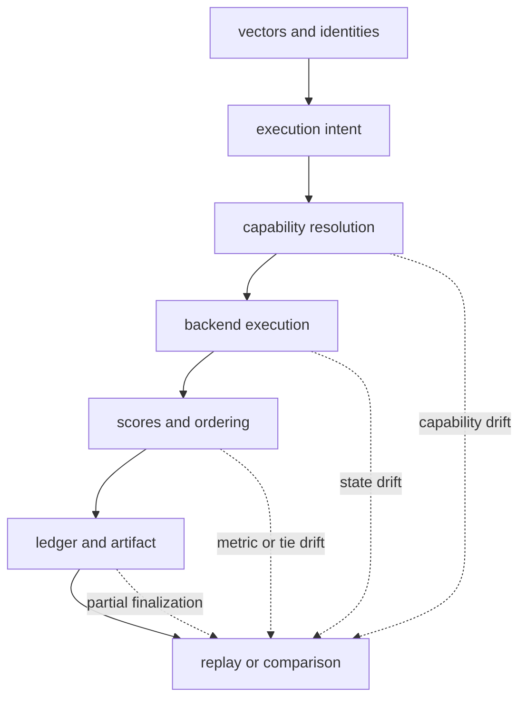
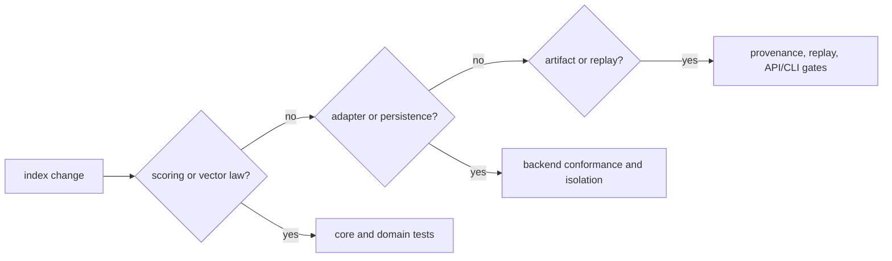

# Risk Register

Index owns execution claims, not merely neighbor lists. A trustworthy result
connects the request, immutable plan, actual capability, backend identity,
ranked output, budgets, and retained artifact. Any break in that chain can
produce plausible output that cannot support replay or audit.

## Risk Topology

## Active Risks And Controls

| Risk | Consequence | Preventive control | Detection evidence | Residual exposure |
| --- | --- | --- | --- | --- |
| vector dimension, metric, or normalization mismatch | scores are valid numbers for the wrong geometry | bind vector contract and scoring policy to the execution plan | dimension, scoring, request-validation, and cross-backend tests | upstream embeddings can be mislabeled before index receives them |
| backend overstates exactness or capability | ANN or fallback output is presented as an exact result | validate declared capability and refuse dishonest backends | dishonest-backend, ANN fallback, and execution-contract tests | plugin behavior outside reviewed calls remains external code |
| unstable tie ordering | identical scores produce different result order | canonical secondary ordering and serialization | scoring, tie-break, determinism, and output snapshot tests | backend floating-point changes can alter whether scores tie |
| backend parameters or state drift | replay executes against a materially different index | fingerprint runner, parameters, artifact, and state | backend drift, provenance fingerprint, and golden replay tests | remote services can mutate outside package control |
| budget exhaustion is flattened into normal top-`k` | partial evidence looks complete | typed budget limits, partial classification, and refusal | budget enforcement and slow-budget scenarios | callers can ignore the partial or refusal status |
| run, tenant, or authorization isolation fails | one execution reads or mutates another's state | scoped resources, authorization checks, and execution isolation | authz, cross-run isolation, concurrency, and store conformance tests | external service tenancy must be configured correctly |
| transaction or artifact finalization is partial | ledger, run record, and native files disagree | explicit lifecycle states and atomicity contracts | transaction misuse, atomicity, lifecycle, corruption, and multi-artifact scenarios | no package-level transaction controls an external service backup |
| idempotency key binds to different intent | a repeated request returns unrelated prior output | include normalized request identity in idempotency semantics | API idempotency and orchestration tests | consumer-provided keys can still be reused incorrectly |
| provenance leaks vectors or service metadata | retained evidence exposes sensitive inputs or topology | redact metadata and bound retained diagnostics | vector-store redaction and provenance tests | deployment policy determines what data is sensitive |
| compatibility CLI is mistaken for a canonical console contract | new automation depends on `bijux-vex` indefinitely | publish Python/HTTP as canonical surfaces and label CLI continuity explicitly | packaging, public API, and compatibility bridge tests | existing command consumers require deliberate redesign |

## Evidence Routing

Changes commonly require multiple routes. A new ANN adapter needs domain
capability checks, backend conformance, exact-versus-ANN comparison, drift and
replay evidence, plus boundary tests for any new public configuration.

## Operational Interpretation

These hazards persist even when the default in-memory and SQLite paths pass.
Deployment owners must additionally govern plugin provenance, remote service
tenancy, backups, resource ceilings, dependency versions, and benchmark
context. Report performance and quality with the exact execution identity.

Use [architecture risks](../architecture/architecture-risks.md) for failure
mechanisms, [test strategy](test-strategy.md) for executable evidence, and
[known limitations](known-limitations.md) for exclusions from the stable
contract.
