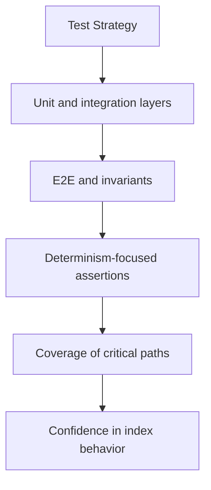

# Test Strategy

The tests for `bijux-canon-index` are the executable proof of its package contract.

This page should help readers see the broad proof shape of the package rather
than treating the test tree like a bag of unrelated checks. A good strategy page
explains why these tests exist, not just where they live.

Treat the quality pages for `bijux-canon-index` as the proof frame around the package. They should show how trust is earned and where skepticism still belongs.

## Visual Summary

## Test Areas

- tests/unit for API, application, contracts, domain, infra, and tooling
- tests/e2e for CLI workflows, API smoke, determinism gates, and provenance gates
- tests/conformance and tests/compat_v01 for compatibility behavior
- tests/stress and tests/scenarios for operational pressure checks

## Concrete Anchors

- tests/unit for API, application, contracts, domain, infra, and tooling
- tests/e2e for CLI workflows, API smoke, determinism gates, and provenance gates
- README.md

## Use This Page When

- you are reviewing tests, invariants, limitations, or ongoing risks
- you need evidence that the documented contract is actually defended
- you are deciding whether a change is truly done rather than merely implemented

## Decision Rule

Use `Test Strategy` to decide whether `bijux-canon-index` has actually earned trust after a change. If one narrow green check hides a wider contract, risk, or validation gap, the work is not done yet.

## What This Page Answers

- what currently proves the `bijux-canon-index` contract instead of merely describing it
- which risks, limits, and assumptions still need explicit skepticism
- what a reviewer should be able to say before accepting a change as done

## Reviewer Lens

- compare the documented proof story with the actual test layout and release posture
- look for limitations or risks that should have moved with recent behavior changes
- verify that the claimed done-ness standard still reflects real validation practice

## Honesty Boundary

This page explains how `bijux-canon-index` is supposed to earn trust, but it does not claim that prose alone is enough. If the listed tests, checks, and review practice stop backing the story, the story has to change.

## Next Checks

- move to foundation when the risk appears to be boundary confusion rather than missing tests
- move to architecture when the proof gap points to structural drift
- move to interfaces or operations when the proof question is really about a contract or workflow

## Purpose

This page explains the broad testing shape of the package.

## Stability

Keep it aligned with the real test directories and the behaviors they protect.
