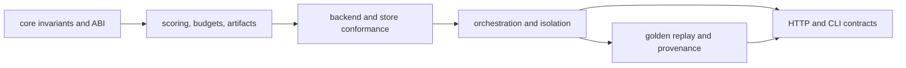

# Test Strategy

Index tests separate algorithm correctness, backend conformance, execution
provenance, and public-interface compatibility. That separation is essential:
an adapter can return plausible neighbors while violating determinism,
isolation, or replay contracts.

## Evidence Layers

```mermaid
flowchart LR
    core["core invariants and ABI"]
    domain["scoring, budgets, artifacts"]
    adapter["backend and store conformance"]
    execution["orchestration and isolation"]
    replay["golden replay and provenance"]
    public["HTTP and CLI contracts"]

    core --> domain --> adapter --> execution --> replay
    execution --> public
    replay --> public
```

The conformance layer prevents one adapter's success from being mistaken for a
package-wide guarantee. Replay and public-boundary gates then establish that
the chosen backend and its evidence remain observable outside the engine.

| Test family | Principal claim |
| --- | --- |
| `tests/unit/core/` | canonical serialization, versions, vector dimensions, immutable plans, execution ABI, invariants, and performance contracts remain stable |
| `tests/unit/domain/` | scoring, artifact lifecycle, drift detection, ANN fallback, budget enforcement, and quality metrics preserve domain rules |
| `tests/unit/infra/` | stores and adapters handle ties, corruption, duplicates, retries, migrations, redaction, and refusal safely |
| `tests/unit/application/` | orchestration, backend pools, and non-deterministic circuit breaking enforce declared policy |
| `tests/unit/contracts/` | authorization and transaction misuse are rejected |
| `tests/conformance/` | implementations share execution, store, isolation, provenance, atomicity, and replay behavior |
| `tests/e2e/determinism_gate/` | exact replay matches and mismatches are observable against golden records |
| `tests/e2e/provenance_gate/` | an explanation can traverse the full recorded chain |
| `tests/e2e/execution_diff/` | ANN output is compared with an exact baseline rather than assumed equivalent |
| `tests/e2e/api_smoke/` and `tests/e2e/cli_workflows/` | public endpoints, flags, exit codes, idempotency, capability reports, and schema freeze remain coherent |

## Contract matrix

| Change | Minimum focused evidence |
| --- | --- |
| scoring or tie-breaking | scoring and tie-order tests, then cross-backend query conformance |
| execution request or plan | core ABI/immutability tests and request determinism conformance |
| artifact or fingerprint | artifact lifecycle, portability, provenance stability, and golden replay |
| ANN parameter or runner | ANN domain tests, exact-versus-ANN diff, replay mismatch, and relevant backend stress test |
| vector-store adapter | adapter unit tests plus store CRUD, transaction, isolation, and cross-backend suites |
| budget or partial result | budget unit tests and slow-budget scenario |
| API model | DTO validation, OpenAPI validation/freeze, then API smoke tests |
| CLI option or output | exit-code tests, flag snapshot, output determinism, and basic workflow |
| compatibility contract | v0.1 API/CLI snapshots and golden replay compatibility |

## Adversarial evidence

Failure injection and misuse suites exercise behavior that happy-path retrieval
cannot reveal: corrupt artifacts, dishonest capability declarations, cross-run
leakage, transaction misuse, denied authorization, stale metadata, unavailable
ANN support, and replay against changed inputs. Scenario tests extend those
checks to multi-artifact and scale-oriented cases.

The stress suite for optional FAISS behavior is intentionally distinct from
the deterministic default gate. Its value is finding backend-specific
resource, duplicate, and concurrency defects; it does not redefine the common
execution contract.

## Benchmark interpretation

Benchmarks and medium-scale fixtures are regression evidence, not universal
capacity claims. Record the dataset, backend, parameters, dependency versions,
and hardware before comparing results. A latency improvement accompanied by
lower recall or a changed approximation report is a different outcome, not an
unqualified performance improvement.

## Regression standard

A retrieval defect should be reproduced first at the layer that owned the
false claim. Add conformance coverage when another backend could repeat it,
and add golden replay coverage when serialized artifacts or fingerprints are
affected. This ensures the suite can identify whether a later regression came
from the algorithm, adapter, provenance chain, or public interface.

## Claims Outside The Test Boundary

The suite does not establish universal recall, latency, or capacity; certify an
unreviewed plugin; prove the security of an external vector service; or make
ANN output mathematically exact. Those claims require a named dataset,
backend, parameters, dependency versions, hardware, service configuration, and
retained execution evidence.
