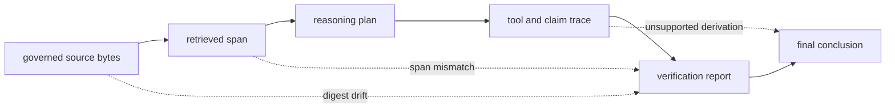

# Architecture Risks

Reasoning output can be coherent, deterministic, and still unsupported. The
architecture therefore protects the evidence chain separately from textual
quality and treats lost support as a first-class failure.

## How Support Can Be Lost

Readable text is not enough. The chain remains trustworthy only when source
bytes, spans, digests, plan topology, trace linkage, and verification policy
can all be inspected together.

## Risk Register

| Risk | Misleading conclusion | Control |
| --- | --- | --- |
| citation without exact support | a document label is treated as proof | require byte span and digest validation |
| content identity mistaken for truth | stable IDs are presented as scientific correctness | keep integrity, verification, and truth claims separate |
| runtime drift | the same spec runs with different tools or configuration | fingerprint the runtime descriptor |
| permissive verification | warning or info findings disappear from review | retain the complete report and selected policy |
| incomplete bundle publication | a trace exists but manifest or provenance is absent | require the core set and valid manifest |
| concurrent stable-ID writers | identical inputs race in the same run directory | isolate artifact roots or serialize writers |
| replay overclaim | recorded-call reconstruction is described as a fresh provider reproduction | state frozen replay semantics explicitly |
| path or content escape | support resolves outside governed artifacts or exposes sensitive evidence | enforce path guards, digests, and access controls |

## Determinism Does Not Establish Correctness

Canonical serialization and content-derived identifiers prove stable
representation. Trace replay proves equality under recorded runtime and
artifact constraints. Verification proves that implemented structural and
grounding checks passed. None of these alone establishes that evidence is true,
complete, current, or scientifically sufficient.

Claims should state which layer of assurance they rely on.

## Support Can Break Without Visible Text Changes

Support uses byte spans. Encoding conversion, newline rewriting, Unicode
normalization, or source replacement can invalidate a digest while rendered
text looks unchanged. Preserve governed source bytes with the run and treat a
digest mismatch as new evidence, not harmless formatting.

## Verification Policy Can Conceal Findings

Strict and audit policies retain all findings; permissive policy retains only
error-severity findings. If downstream systems keep only a pass/fail summary,
they lose the information needed to understand warnings or policy changes.
Retain `verify.json`, policy identity, and individual invariant IDs.

## Run Completion Is Manifest-Based

The builder writes several files sequentially and writes the manifest after the
core evidence. There is no transactional directory commit. A crash can leave a
plausible partial run. Consumers must validate the complete core set and
manifest rather than accept `trace.jsonl` alone.

Because run identity derives from spec, preset, seed, and runtime fingerprint,
equivalent concurrent runs target the same directory. Coordinate writers or
use isolated roots.

## Replay Can Hide External Change

Frozen replay intentionally uses recorded tool results. It can detect internal
trace divergence without proving that a search service, model, website, or
dataset would return the same result today. Rechecking an external dependency
is a new execution with a comparison, not replay of the original.

## Local Retrieval Can Blur the Index Boundary

The local BM25 path supports evidence gathering for a reason run. Adding
general backend governance, ANN policy, or vector replay behavior here would
duplicate `bijux-canon-index`. Keep retrieval bounded to reasoning evidence or
integrate the canonical index package through a tool contract.

## Evaluation Scope Can Be Overstated

The current evaluation command implements a package-owned workflow, while its
suite selector remains limited. A summary file is not evidence of arbitrary
benchmark coverage. Retain the executed cases, seed, producer version, and
actual suite implementation with any evaluation claim.

See [security and safety](../operations/security-and-safety.md) and
[known limitations](../quality/known-limitations.md) for deployment controls.
