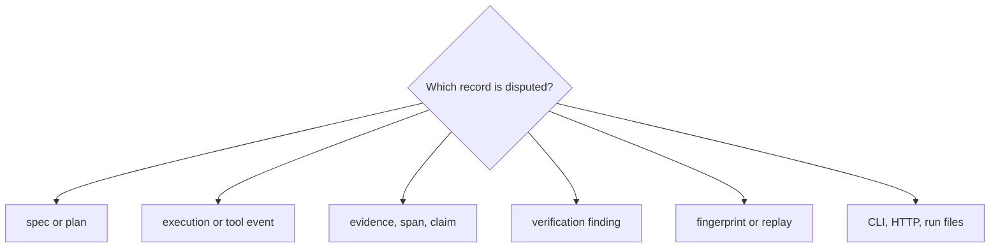

# Code Navigation

Navigate reason by the record whose trust is in question: specification, plan,
event, evidence, claim, finding, or run file. Each record has an owning model,
producer, verifier, and serialization boundary.

## Navigate by concern

| Concern | Begin in | Continue in | Evidence family |
| --- | --- | --- | --- |
| spec, plan, claim, trace, or verification shape | `core/models/` | canonical serialization and validators | core model, version, and cross-platform tests |
| plan identity or graph topology | `planning/` | planning models and execution preparation | planner determinism and DAG tests |
| action order or fail-fast behavior | `execution/executor.py` and step execution | trace metadata and tool dispatch | execution and lifecycle tests |
| runtime or tool integration | runtime and tool protocol modules | replay runtime and run metadata | mode, linkage, and frozen-result tests |
| evidence registration or support spans | `execution/evidence_records.py` and claims model | provenance verification | span, hash, multibyte, and tamper tests |
| local corpus, chunking, BM25, or drift | `retrieval/` | execution retrieval path and `provenance/` artifacts | retrieval ordering, byte-limit, reuse, and drift tests |
| extractive claim or insufficiency | `reasoning/` | claim emission and finalization checks | reasoning and retrieval-reasoning tests |
| verifier result | `verification/check_registry.py` and `verifier.py` | structural and provenance check modules | focused pass/fail tests per invariant |
| checksum, fingerprint, or replay diff | `traces/` | run workflow and replay runtime | checksum, mismatch, and replay gate tests |
| run directory | `application/run_workflow.py` and `run_artifacts.py` | CLI/API routes and artifact readers | CLI tamper and API contract tests |

Paths are relative to
`packages/bijux-canon-reason/src/bijux_canon_reason/` unless stated otherwise.

## Follow one claim

1. Read `Claim` and `SupportRef` in `core/models/claims.py`.
2. Locate claim creation in the reasoning or step-execution path.
3. Find the evidence registration event and retained evidence bytes.
4. Follow the ordered verifier registry through grounding, hash, and span
   checks.
5. Confirm the claim and findings in `trace.jsonl` and `verify.json`.
6. Validate `fingerprint.txt`, the invariant checksum in `run_meta.json`, and
   the relevant entries in `manifest.json`.

## Diagnose from the disputed record

| Symptom | Inspect first | Follow into | Evidence that closes the diagnosis |
| --- | --- | --- | --- |
| plan changes for identical specification | canonical spec bytes and content ID | planner topology/order and stable identifiers | node/edge diff with deterministic plan fixture |
| step or tool event is missing/reordered | trace event sequence and lifecycle identifiers | executor, tool dispatch and trace construction | complete start/call/result/finish or typed failure chain |
| evidence cannot be opened | manifest path, artifact root and content digest | evidence registration and path-safety verification | authorized relative path plus matching file hash |
| citation text does not match support | support kind, byte bounds and snippet digest | claims model and provenance/span checks | exact byte slice hashes to the recorded digest |
| claim is validated despite missing support | claim type/status and supports | reasoning emission then applicable check registry | all applicable findings and derived status agree |
| insufficient evidence becomes a confident claim | retrieval results and insufficiency event | extractive reasoner and finalization checks | explicit insufficient outcome or valid exact support |
| verifier appears to skip a rule | registry contents, applicability and unavailable-check outcome | check implementation and report aggregation | named finding for every applicable registered check |
| replay calls a live tool | replay runtime descriptor and call records | `execution/replay_runtime.py` and run workflow | frozen result use or explicit separate new execution |
| manifest passes after a file changes | per-file digest and run identity | artifact discovery, manifest verification and replay | precise changed/missing/foreign file refusal |
| CLI and HTTP disagree on the same run | canonical artifact readers and application result | interface serialization/status mapping | same files yield equivalent typed disposition |

Read from the most specific retained identity outward. A verification summary
is not enough when the underlying finding, evidence span or manifested file is
the record in dispute.

## Place changes with their evidence owner

| Desired change | Primary location | Required proof expansion |
| --- | --- | --- |
| public problem/plan/evidence/claim/trace field | `core/models/` and canonical serializers | identity, schema, version and compatibility fixtures |
| planning rule or node kind | `planning/` | DAG laws, content identity and execution compatibility |
| tool/runtime execution behavior | `execution/` | call linkage, limits, typed failures and frozen replay |
| local evidence lookup | `retrieval/` | corpus identity, ordering, bounds, provenance and drift |
| claim/support or insufficiency behavior | `reasoning/` | exact supports and corresponding verification cases |
| invariant or check | `verification/` | positive, negative, unavailable and aggregate-report evidence |
| trace/replay identity | `traces/` | byte/semantic fingerprints, mismatch and tamper matrix |
| complete run or artifact layout | `application/` | manifest custody plus CLI/API read/verify/replay paths |

When a transport exposes an existing use case, keep claim and check semantics
below the transport. When a new model field affects identity, update every
serializer, manifest and replay comparison that depends on it.

## Boundary landmarks

| Landmark | Why it matters |
| --- | --- |
| `core/system_contract.py` | supported protocol and package-system identity |
| `interfaces/serialization/` | canonical JSON and JSONL byte contract |
| `api/v1/run_routes.py` | retained-run inspection, verification, and replay boundary |
| `apis/bijux-canon-reason/v1/schema.yaml` | versioned HTTP contract |
| `tests/e2e/cli/` | public artifact creation and tamper refusal |
| `tests/e2e/retrieval_reasoning/` | pinned retrieval-to-claim and snapshot replay path |

Place a defect at the narrowest record owner. Add an end-to-end case when the
defect could leave a credible-looking manifested run despite being invalid.
