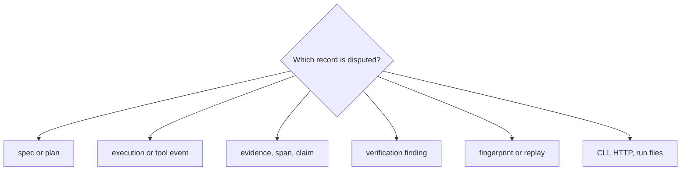

# Code Navigation

Navigate reason by the record whose trust is in question: specification, plan,
event, evidence, claim, finding, or run file. Each record has an owning model,
producer, verifier, and serialization boundary.

## Navigate by concern

| Concern | Begin in | Continue in | Evidence family |
| --- | --- | --- | --- |
| spec, plan, claim, trace, or verification shape | `core/models/` | canonical serialization and validators | core model, version, and cross-platform tests |
| plan identity or graph topology | `planning/` | planning models and execution preparation | planner determinism and DAG tests |
| action order or fail-fast behavior | `execution/executor.py` and step execution | trace metadata and tool dispatch | execution and lifecycle tests |
| runtime or tool integration | runtime and tool protocol modules | replay runtime and run metadata | mode, linkage, and frozen-result tests |
| evidence registration or support spans | `execution/evidence_records.py` and claims model | provenance verification | span, hash, multibyte, and tamper tests |
| local corpus, chunking, BM25, or drift | `retrieval/` | execution retrieval path and `provenance/` artifacts | retrieval ordering, byte-limit, reuse, and drift tests |
| extractive claim or insufficiency | `reasoning/` | claim emission and finalization checks | reasoning and retrieval-reasoning tests |
| verifier result | `verification/check_registry.py` and `verifier.py` | structural and provenance check modules | focused pass/fail tests per invariant |
| checksum, fingerprint, or replay diff | `traces/` | run workflow and replay runtime | checksum, mismatch, and replay gate tests |
| run directory | `application/run_workflow.py` and `run_artifacts.py` | CLI/API routes and artifact readers | CLI tamper and API contract tests |

Paths are relative to
`packages/bijux-canon-reason/src/bijux_canon_reason/` unless stated otherwise.

## Follow one claim

1. Read `Claim` and `SupportRef` in `core/models/claims.py`.
2. Locate claim creation in the reasoning or step-execution path.
3. Find the evidence registration event and retained evidence bytes.
4. Follow the ordered verifier registry through grounding, hash, and span
   checks.
5. Confirm the claim and findings in `trace.jsonl` and `verify.json`.
6. Validate `fingerprint.txt`, the invariant checksum in `run_meta.json`, and
   the relevant entries in `manifest.json`.

## Boundary landmarks

| Landmark | Why it matters |
| --- | --- |
| `core/system_contract.py` | supported protocol and package-system identity |
| `interfaces/serialization/` | canonical JSON and JSONL byte contract |
| `api/v1/run_routes.py` | retained-run inspection, verification, and replay boundary |
| `apis/bijux-canon-reason/v1/schema.yaml` | versioned HTTP contract |
| `tests/e2e/cli/` | public artifact creation and tamper refusal |
| `tests/e2e/retrieval_reasoning/` | pinned retrieval-to-claim and snapshot replay path |

Place a defect at the narrowest record owner. Add an end-to-end case when the
defect could leave a credible-looking manifested run despite being invalid.
