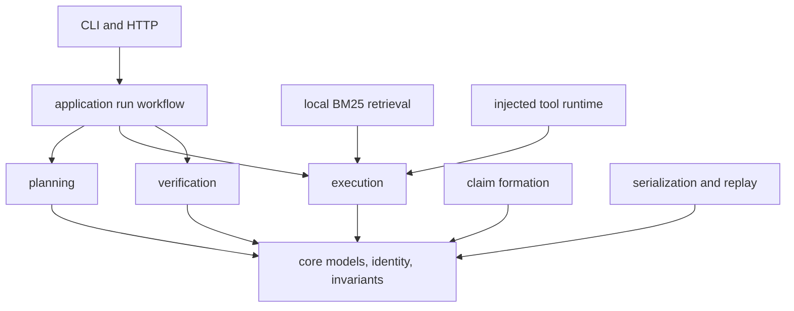

# Dependency Direction

Reason keeps the public evidence vocabulary independent from execution and
delivery. A `ProblemSpec`, `Claim`, `SupportRef`, `Trace`, or
`VerificationReport` can be constructed and validated without starting a CLI,
HTTP server, retrieval engine, or tool runtime.

The inner model states what a reasoning record means. Execution supplies facts
to that model; interfaces transport it.

## Core Model Independence

`core.models` owns problem, plan, evidence, support, claim, tool, trace,
runtime, and verification contracts. `core` also owns canonical JSON, content
fingerprints, stable identifiers, system invariants, and cross-model
validation.

These modules must not import FastAPI, Typer, filesystem paths selected by a
command, or concrete retrieval and model clients. Content identity should be
computable from canonical values alone.

## Domain Computation

`planning` turns a problem into a dependency graph. `reasoning` forms typed
claims and explicit insufficient-evidence outcomes. `verification` evaluates
structure, tool linkage, provenance, grounding, support spans, and
finalization.

Verification depends on core contracts and permitted artifact access. Core
models do not depend on verification findings; otherwise the definition of a
claim would vary with one policy configuration.

## Execution Direction

`execution` coordinates nodes and tool calls through an `ExecutionRuntime`.
Concrete local, frozen replay, test, and retrieval runtimes implement that
boundary. Execution records runtime kind, mode, tools, versions, configuration,
and fingerprints rather than hiding the implementation behind a generic call.

The local BM25 implementation supports a self-contained reasoning run, but it
is an execution dependency, not the source of claim semantics. Moving ranking
parameters into `Claim` or `SupportRef` would reverse ownership.

## Application and Interface Direction

`application` composes planning, execution, verification, serialization, and
manifest construction into a run. `interfaces` owns CLI, JSON, JSONL, path
guards, and HTTP translation. Interfaces may decide response or exit behavior;
they may not weaken a failed verification report or rewrite a trace.

The API and CLI depend on the same application contracts but have different
lifecycles. The API owns process-level run access; the CLI owns explicit
artifact paths. Neither is an inner reasoning dependency.

## Forbidden Reversals

- core models reading environment variables or opening evidence files;
- a retrieval adapter deciding whether a claim is supported;
- a CLI flag changing canonical serialization without a schema change;
- verification invoking live tools to repair missing trace evidence;
- replay mutating the original run directory or replacing recorded results.

Use the [module map](module-map.md) for ownership and
[integration seams](integration-seams.md) for external boundaries.
