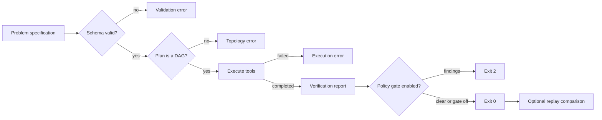

# Error Model

`bijux-canon-reason` distinguishes an invalid request, an execution failure, a
verification finding, and a replay difference. Those outcomes mean different
things: only the first two prevent a run from being constructed, while the
latter two describe evidence about a completed artifact set.

## Failure classes

| Class | Meaning | Representation |
| --- | --- | --- |
| Input validation | A `ProblemSpec`, API body, or serialized artifact violates its schema | Pydantic validation error; HTTP `422` at the API boundary |
| Plan topology | An edge names an unknown node, a dependency is missing, or the graph contains a cycle | exception containing invariant code `INV-ORD-001` |
| Tool execution | A planned tool invocation cannot produce its declared result | failed tool result; raised `RuntimeError` under the default fail-fast policy |
| Artifact integrity | Required evidence is absent or its SHA-256 digest differs | `FileNotFoundError` or `ValueError` while assembling or verifying artifacts |
| Verification | A completed trace violates a structural, provenance, grounding, or finalization invariant | typed entries in `VerificationReport.failures` |
| Replay | A rerun does not reproduce the recorded trace and outputs | structured replay diff; optionally a non-zero CLI exit |

Topology is checked before any node executes. This prevents partial traces from
being mistaken for complete runs. The executor's default policy is fail-fast;
callers using the Python API may opt out and inspect accumulated tool failures.

## Findings are data

A verification failure is not an exception. `verify_trace` returns a report
with its own content-derived identifier, the checks performed, typed failures,
and summary metrics. Findings have `info`, `warning`, or `error` severity and
are filtered according to the selected policy:

- `strict` retains every finding;
- `audit` also retains every finding for inspection;
- `permissive` retains only error-severity findings.

The CLI makes the policy decision explicit. `run --fail-on-verify` exits with
status `2` when the generated verification report contains failures. Without
that flag, the command still writes `verify.json` and reports the failure count.
Likewise, replay differences become exit status `2` only when
`--fail-on-diff` is enabled.

## What a caller can rely on

Every successful artifact-producing run writes the specification, plan, JSONL
trace, verification report, fingerprint, run metadata, and manifest beneath one
run directory. A consumer should treat the manifest and digests as the
integrity boundary and the verification report as the semantic assessment.
Neither an exit status of zero nor a digest match alone establishes that a
claim is scientifically true.
