# Execution Model

`bijux-canon-reason` produces a claim only through an inspectable plan and an
event trace. Planning, tool execution, evidence registration, claim formation,
verification, and finalization are separate proof boundaries.

```mermaid
flowchart LR
    spec["ProblemSpec"]
    plan["content-addressed Plan"]
    execute["ordered plan execution"]
    evidence["evidence + support spans"]
    claims["typed claims"]
    trace["canonical trace"]
    verify["verification report"]
    artifacts["manifested run directory"]

    spec --> plan --> execute
    execute --> evidence --> claims --> trace --> verify --> artifacts
```



## Problem and Plan

`ProblemSpec` names the description, constraints, expected output type, and
optional expected result. Its ID is derived from content when the caller does
not supply one. The planner creates a directed plan whose nodes use five stable
kinds: `understand`, `gather`, `derive`, `verify`, and `finalize`.

Plan nodes name dependencies, tool requests, notes, and parameters. Node and
plan IDs are content-addressed, so a changed dependency, tool request, or
parameter produces different plan identity rather than silently reusing an old
one.

## Execution and Trace

The application validates the package system contract, resolves the spec ID,
plans the problem, and executes with fail-fast policy. A trace records the
ordered facts of execution:

- plan actions starting and finishing;
- tool calls and their results;
- evidence registrations; and
- claim emissions.

Finished actions use typed outputs. In addition to the five plan kinds, a run
can record `insufficient_evidence` explicitly. That result is a meaningful
reasoning outcome, not a transport failure.

The default runtime is seeded, local, and credential-free. It exposes no
synthetic tools. A spec with `needs_retrieval` requires an explicit corpus path
and uses the local BM25 runtime with pinned chunk size, overlap, and BM25
parameters. A run without retrieval can still plan and terminate with an
explicit insufficient-evidence outcome. A caller may inject another
`ExecutionRuntime`, but its kind, mode, tools, versions, and configuration
fingerprints become part of the retained runtime descriptor.

## Evidence and Claims

An evidence registration binds a URI, content hash, byte span, chunk ID, and
relative artifact path. A claim states whether it is derived, observed, or
assumed and whether it is proposed, validated, or rejected. Every support
reference names another claim, evidence item, or tool call and includes a byte
span and SHA-256 hash of the supported snippet.

This makes support inspectable at the byte level. A claim does not become
grounded merely because it cites a document ID; the verifier can check that the
referenced bytes exist, fit inside the evidence span, and hash to the recorded
snippet value.

## Verification

After execution, the verifier checks core invariants, tool linkage, claim
references, derived grounding, reasoning structure, insufficient-evidence
behavior, finalized-claim status, required plan actions, evidence hashes, and
support spans. The report retains every check, failure severity, invariant ID,
and summary count.

The run builder then adds the runtime fingerprint and invariant checksum to the
trace metadata, serializes the evidence set, fingerprints the trace file, and
builds a SHA-256 manifest for core and provenance files.

## Identity and Replay Boundary

The run ID is derived from spec identity, preset, seed, and runtime fingerprint.
Replay loads the original spec, plan, trace, runtime descriptor, and recorded
tool results. It validates the original invariant checksum before execution,
runs through a frozen runtime, checks the checksum again, and emits a separate
replay trace and structural diff.

The fingerprint comparison is therefore the end of a verification chain, not a
standalone equality test. A missing plan, changed pinned corpus, mismatched
retrieval provenance, or invalid checksum prevents replay from claiming
equivalence.

## Proof Gates

Each boundary answers a narrower question than the one after it. Passing an
earlier gate does not imply that later evidence exists.

| Gate | Question answered | Evidence produced |
| --- | --- | --- |
| specification | is the requested problem well formed? | validated `ProblemSpec` and stable identity |
| planning | is there an acyclic, dependency-complete route to an answer? | content-addressed plan and ordered nodes |
| execution | did each scheduled action produce its declared output? | canonical events, tool results, evidence, and claims |
| verification | do trace structure and support relationships satisfy the selected policy? | typed checks, findings, and summary counts |
| finalization | is the artifact set complete and internally fingerprinted? | runtime metadata, trace fingerprint, and manifest |
| replay | can frozen inputs reproduce a comparable execution? | replay trace and structural diff |

```mermaid
sequenceDiagram
    participant Caller
    participant Planner
    participant Executor
    participant Verifier
    participant RunStore
    Caller->>Planner: validated ProblemSpec
    Planner-->>Executor: content-addressed Plan
    Executor->>Executor: emit ordered events and support links
    Executor-->>Verifier: trace, claims, and evidence
    Verifier-->>RunStore: VerificationReport
    RunStore->>RunStore: fingerprint files and write manifest
    RunStore-->>Caller: immutable run directory
    Note over Caller,RunStore: replay reads the artifact set; it does not reconstruct omitted inputs
```

The manifest establishes file integrity, the verification report establishes
which semantic checks passed, and replay establishes a comparison under frozen
inputs. None of those layers proves an external scientific proposition by
itself. They make the route from request to claim inspectable and falsifiable.

## Completion and Insufficient Evidence

`insufficient_evidence` is a completed typed output when execution reaches that
conclusion through the plan. It is not equivalent to a missing evidence file, a
failed retrieval call, or an aborted executor. The former can be verified and
replayed as a reasoning outcome; the latter are failures to construct the
promised evidence path.

A run becomes publishable only after its core files, provenance files,
fingerprints, and manifest agree. Consumers should start at the manifest and
verification report, then inspect individual claims and support spans. A loose
`trace.jsonl` file is useful diagnostic material, not a complete run artifact.

See [Artifact Contracts](../interfaces/artifact-contracts.md) for the on-disk
evidence set and [Failure Recovery](../operations/failure-recovery.md) for
triage.
