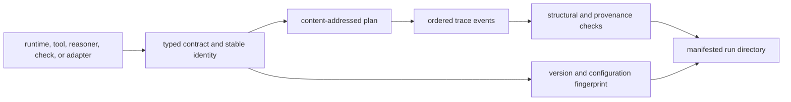

# Extensibility Model

Reason extensions enter through execution runtimes, named tools, structured
reasoners, verification checks, or interface adapters. Every extension must
leave the evidence chain stronger than plain generated text: inputs, effects,
claims, supports, failures, and replay conditions remain typed and retained.

## Extension path

An extension that cannot describe its behavior and evidence contribution
cannot participate in a replayable reason run.

## Supported extension points

| Seam | Suitable extension | Required obligations |
| --- | --- | --- |
| `ExecutionRuntime` | Live, local, remote, or application-controlled execution | Stable runtime kind and mode, named tool inventory, versions, configuration fingerprint, seeded invocation, and normalized failures |
| Tool protocol | Retrieval, computation, or model-backed capability | Stable tool name/version, typed `ToolCall` to `ToolResult` linkage, bounded effects, and registered evidence identity |
| `ReasonerBackend` | Structured derivation strategy | Emit typed derivations and citations, respect insufficient evidence, avoid untracked side effects, and expose implementation identity through the runtime/run configuration |
| Verification sequence | Additional structural or provenance invariant | Stable check and invariant identifiers, deterministic ordering, explicit severity, actionable failures, and policy-aware reporting |
| Retrieval runtime | External corpus or search integration | Preserve corpus and candidate provenance, exact evidence bytes, content digests, selection configuration, and a frozen replay path |
| CLI or HTTP adapter | New transport or application workflow | Load and emit canonical models, confine artifact paths, retain the complete run bundle, and add no alternate claim meaning |

The built-in check sequence is ordered. Adding or reordering checks can change
report identity and acceptance behavior; treat it as a verification-contract
change rather than a private implementation detail.

## Evidence obligations

External retrieval and reasoning integrations must retain the bytes used to
support claims. A URL, candidate ID, rendered paragraph, or provider response
identifier alone cannot validate a `SupportRef`. The run needs a permitted
relative evidence path, file digest, exact non-empty byte interval, and snippet
SHA-256.

If the upstream source cannot be retained, the extension must make that
limitation explicit and must not claim frozen file-backed replay. A later live
call is a new run, not a reconstruction of the old one.

## Non-extension boundaries

Extensions must not:

- mutate canonical specification, plan, trace, claim, or manifest models after
  identity has been established;
- convert an assumed or observed claim into a validated derived claim without
  the required supports and checks;
- catch tool failure and emit plausible text as if the call succeeded;
- resolve evidence outside the configured artifact root;
- normalize or re-encode evidence after byte spans have been recorded;
- omit runtime or provider changes from fingerprints;
- replace frozen replay with another live provider invocation.

## Conformance evidence

An extension is ready when deterministic fixtures cover successful and failed
calls, descriptor stability, call/result linkage, exact support verification,
manifest coverage, and frozen replay. For non-deterministic providers, record
the sources of variation and prove that strict replay refuses when equivalence
cannot be established.

See [data contracts](../interfaces/data-contracts.md) for model semantics and
[security and safety](../operations/security-and-safety.md) for artifact-root,
provider, and network controls.
