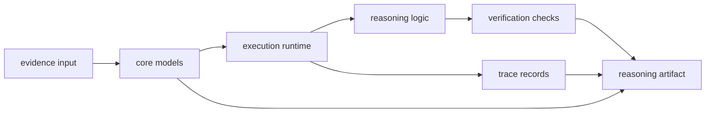

# Architecture

Open this section when the question is structural: where claims and checks are formed, how reasoning steps flow through the package, and how the code keeps meaning visible instead of scattering it.

## Structural Shape

Reason architecture centers on explicit reasoning artifacts. Core models define
claims, plans, traces, and verification results; execution modules run steps
and tools; verification modules check structure and provenance; trace modules
make the result replayable rather than just plausible.

The architectural point of reason is that interpretation stays inspectable.
Models define the shapes that matter, execution runs the step, reasoning logic
forms the conclusion, verification constrains it, and traces preserve enough
history for comparison or replay later.

## Read These First

- open [Module Map](https://bijux.io/bijux-canon/04-bijux-canon-reason/architecture/module-map/) first when you need the owning code area for a reasoning concern
- open [Execution Model](https://bijux.io/bijux-canon/04-bijux-canon-reason/architecture/execution-model/) when you need the path from evidence input to reasoning output
- open [Integration Seams](https://bijux.io/bijux-canon/04-bijux-canon-reason/architecture/integration-seams/) when a change could blur retrieval, orchestration, or runtime boundaries

## Structural Risk

The main architectural risk here is hiding reasoning policy in the wrong layer until no one can point to the module that actually decided what a claim means.

## First Proof Check

- `packages/bijux-canon-reason/src/bijux_canon_reason/core/models` for claims, planning, trace, and verification models
- `packages/bijux-canon-reason/src/bijux_canon_reason/execution` for runtime and tool execution boundaries
- `packages/bijux-canon-reason/src/bijux_canon_reason/verification` for checks that keep claims reviewable
- `packages/bijux-canon-reason/tests` for proof that claims, checks, and provenance stay aligned

## Pages In This Section

- [Module Map](https://bijux.io/bijux-canon/04-bijux-canon-reason/architecture/module-map/)
- [Dependency Direction](https://bijux.io/bijux-canon/04-bijux-canon-reason/architecture/dependency-direction/)
- [Execution Model](https://bijux.io/bijux-canon/04-bijux-canon-reason/architecture/execution-model/)
- [State and Persistence](https://bijux.io/bijux-canon/04-bijux-canon-reason/architecture/state-and-persistence/)
- [Integration Seams](https://bijux.io/bijux-canon/04-bijux-canon-reason/architecture/integration-seams/)
- [Error Model](https://bijux.io/bijux-canon/04-bijux-canon-reason/architecture/error-model/)
- [Extensibility Model](https://bijux.io/bijux-canon/04-bijux-canon-reason/architecture/extensibility-model/)
- [Code Navigation](https://bijux.io/bijux-canon/04-bijux-canon-reason/architecture/code-navigation/)
- [Architecture Risks](https://bijux.io/bijux-canon/04-bijux-canon-reason/architecture/architecture-risks/)

## Leave This Section When

- leave for [Interfaces](https://bijux.io/bijux-canon/04-bijux-canon-reason/interfaces/) when the structural question is already a public contract question
- leave for [Operations](https://bijux.io/bijux-canon/04-bijux-canon-reason/operations/) when the issue is running, diagnosing, or releasing the package rather than explaining its shape
- leave for [Quality](https://bijux.io/bijux-canon/04-bijux-canon-reason/quality/) when the structure is clear and the real question is whether the package has proved it strongly enough

## Design Pressure

If a reader cannot point to where meaning is formed versus where meaning is
checked, the package has already blurred its own reasoning policy. The
architecture page should keep those responsibilities separate and visible.
