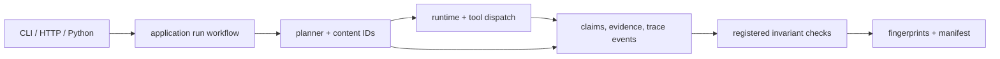
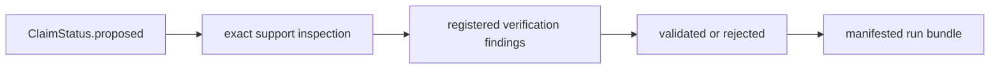

# Architecture

Reasoning is organized as a chain of independently reviewable boundaries:
problem modeling, content-addressed planning, runtime execution, evidence and
claim recording, verification, and artifact finalization. No final prose can
replace the trace that connects those boundaries.

## Execution structure

```mermaid
flowchart LR
    interfaces["CLI / HTTP / Python"]
    workflow["application run workflow"]
    planning["planner + content IDs"]
    execution["runtime + tool dispatch"]
    models["claims, evidence, trace events"]
    verification["registered invariant checks"]
    artifacts["fingerprints + manifest"]

    interfaces --> workflow --> planning --> execution
    execution --> models --> verification --> artifacts
    planning --> models
```

## Proof boundaries

| Boundary | Input | Output | Invariant |
| --- | --- | --- | --- |
| problem | caller description, constraints, expected output | `ProblemSpec` with stable identity | canonical content determines identity when none is supplied |
| plan | problem specification | directed nodes and dependencies | node and plan IDs change when meaningful content changes |
| execution | validated plan and runtime descriptor | ordered typed events | calls, results, evidence, claims, and action completion remain linked |
| grounding | registered evidence and claim support | byte spans and snippet hashes | referenced bytes exist and match the recorded digest |
| verification | plan, trace, runtime, evidence | complete findings and summary | failures remain visible even when policy permits process success |
| finalization | all retained run material | fingerprint, metadata, and manifest | serialized trace and declared files are integrity-checkable |

## Runtime choices

The default runtime is seeded and local. A problem declaring
`needs_retrieval` may use the pinned BM25 path with recorded corpus, chunk, and
index provenance. Other callers can inject an `ExecutionRuntime`, but runtime
kind, mode, tool versions, and configuration fingerprints then become part of
run identity and the replay contract.

Replay uses recorded tool returns through a frozen runtime. It asks whether the
retained inputs and results reproduce the governed trace; it does not re-attest
that an external tool or source would produce the same content today.

## Claim review chain

A claim is not born verified. Its disposition becomes reviewable through
separate records, each of which can narrow or refuse the conclusion. The
intermediate boxes below are review boundaries, not additional `ClaimStatus`
values; the model exposes `proposed`, `validated`, and `rejected`.

```mermaid
flowchart LR
    proposed["ClaimStatus.proposed"]
    grounding["exact support inspection"]
    checks["registered verification findings"]
    disposition["validated or rejected"]
    manifested["manifested run bundle"]
    proposed --> grounding --> checks --> disposition --> manifested
```

| Review boundary | Required record | Invalid shortcut |
| --- | --- | --- |
| support inspection | evidence identity, exact byte span, snippet digest and support edge | accepting a citation label or nearby passage |
| registered checks | check set, complete findings and verification summary | treating evidence presence as successful inference |
| claim disposition | claim status retained with every blocking or limiting finding | relying on process exit or final prose alone |
| bundle finalization | trace, metadata, fingerprints and file digests closed as one run | copying the answer without its rejected claims and findings |

Proposed and rejected claims remain evidence about the run. Removing them from
the trace would make the final prose easier to read but the reasoning less
auditable. The architecture therefore finalizes dispositions and failures with
the same identity discipline as validated claims.

## Module authority

| Area | Authority |
| --- | --- |
| `core/models` | problem, plan, claim, trace, and verification contracts |
| `planning` | intermediate representation and plan construction |
| `execution` | action ordering, tool dispatch, evidence registration, runtime descriptors, and replay runtime |
| `reasoning` and `retrieval` | extractive reasoning and local pinned-corpus BM25 reference paths |
| `verification` | structural, provenance, support, and registered invariant checks |
| `traces` | invariant checksum, replay, fingerprint comparison, and structural diff |
| `application` | complete run construction and artifact finalization |
| `interfaces` and `api/v1` | serialization, access guards, CLI, HTTP, and file boundaries |

## Navigate the design

| Need | Guide |
| --- | --- |
| Locate a model or implementation owner | [Module map](module-map.md) and [Code navigation](code-navigation.md) |
| Follow one complete run and replay | [Execution model](execution-model.md) |
| Understand allowed dependencies | [Dependency direction](dependency-direction.md) |
| Distinguish immutable records from filesystem state | [State and persistence](state-and-persistence.md) |
| Integrate another runtime or evidence source | [Integration seams](integration-seams.md) and [Extensibility model](extensibility-model.md) |
| Understand controlled outcomes and failures | [Error model](error-model.md) |
| Review architectural failure modes | [Architecture risks](architecture-risks.md) |
