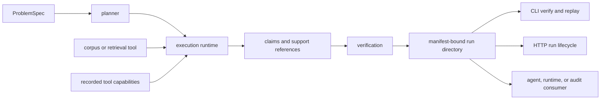

# Integration Seams

Reason integrates through declared problems, bounded tool runtimes, exact
evidence references, and manifest-bound run directories. A text answer without
those boundaries is usable prose, but it is not a complete reason artifact.

## Seam Map

## Problem Seam

`ProblemSpec` is the caller's durable input. It declares description,
constraints, expected output type, optional expected structure, and schema
version. Equivalent canonical content produces the same identity.

Do not pass prompt text plus untracked application settings and later describe
the output as content-addressed. Every input that changes plan or acceptance
meaning belongs in the specification, preset, runtime descriptor, or retained
configuration.

## Tool Runtime Seam

`ExecutionRuntime` supplies named tools and returns typed `ToolResult` values.
The runtime descriptor records kind, mode, tool inventory, versions, and
configuration fingerprint. Live integrations must translate provider failures
into the package execution model and preserve request/result linkage.

Replay uses a frozen runtime backed by recorded calls. It does not invoke live
providers to approximate historical behavior. A new live call is a new run,
even if the prompt is identical.

## Retrieval Seam

Reason can use a pinned local corpus and BM25 index. The run may preserve
`corpus.jsonl`, chunk records, index data, and
`retrieval_provenance.json` beneath `provenance/`. Trace metadata and disk
provenance must agree before replay.

External retrieval can implement the same tool boundary, but it must return
stable evidence identity, content digests, and enough configuration identity
to explain selection. Candidate text alone is not provenance.

## Evidence and Support Seam

`EvidenceRef` identifies source material. `SupportRef` identifies the exact
non-empty byte span and its SHA-256 digest that supports a claim. Verification
resolves these references only within permitted artifact paths.

Applications must preserve byte interpretation and source content. Converting
between encodings or normalizing a file after support spans are recorded
invalidates the reference even when rendered text appears equivalent.

## Artifact Seam

The run directory contains canonical specification, plan, JSONL trace,
verification report, fingerprint, runtime metadata, manifest, and optional
provenance. The manifest binds the core evidence set. Consumers should ingest
the complete directory and reject missing or mismatched members.

There is no independent completion status file. A valid manifest and complete
core set are the completion signal.

## CLI and HTTP Seams

`bijux-canon-reason` creates, verifies, and replays file-backed bundles. The v1
FastAPI application adds run creation and inspection endpoints beneath its
configured artifact root. Both surfaces use the checked model contracts; path,
size, authorization, and retention remain interface responsibilities.

The `bijux-rar` command is a compatibility seam, not another reasoning engine.

## Downstream Seam

Agent and runtime consumers should receive claim, support, trace, verification,
runtime, and manifest identity together. They may apply orchestration or
acceptance policy, but must not reinterpret a missing support span as a valid
claim or overwrite the original verification report.

See [data contracts](../interfaces/data-contracts.md) and
[artifact contracts](../interfaces/artifact-contracts.md) for exact handoffs.
