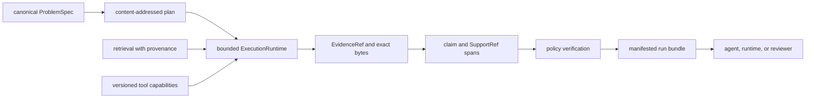
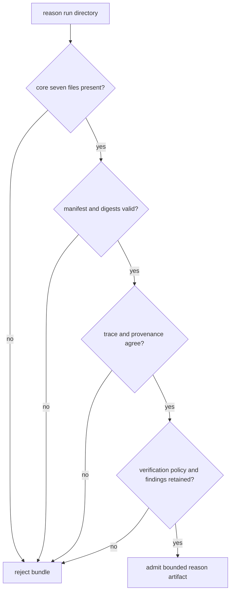

# Integration Seams

Reason is where retrieved material becomes addressable evidence and where
evidence becomes a bounded claim. The integration contract is therefore a
custody chain, not a text-generation callback. A prose answer without the
problem, tool identity, exact supports, verification report, and manifested run
bundle is not a complete reason artifact.

## Evidence Custody

Each arrow transfers identity and meaning. Dropping a digest, coordinate
system, runtime fingerprint, or verification policy weakens every claim to the
right of that boundary.

## Seam Contracts

| Seam | Required input | Reason produces | Refusal boundary |
| --- | --- | --- | --- |
| problem | canonical description, constraints, expected output and structure | stable problem identity and plan input | untracked meaning-bearing settings |
| execution runtime | named tools, versions, mode, configuration fingerprint | typed request/result events and runtime identity | unclassified failure or missing tool identity |
| retrieval | stable evidence identity, exact content, selection provenance | registered evidence and retrieval record | candidate text without source/configuration identity |
| support | evidence bytes and declared coordinate interpretation | non-empty byte span plus SHA-256 digest | missing, out-of-range, changed, or mismatched support |
| verification | trace, plan, artifact root, policy | complete checks, findings, and report identity | structural, provenance, or grounding violation |
| artifact bundle | specification, plan, trace, report, metadata, manifest, provenance | portable review and snapshot replay unit | incomplete core set or invalid manifest |
| downstream | claim, supports, report, trace, runtime and manifest identity | no implicit truth or acceptance decision | consumer attempts to discard or rewrite original evidence |

## Problem And Runtime Identity

`ProblemSpec` is the durable caller input. If an option changes planning or
acceptance meaning, it belongs in the specification, preset, runtime descriptor,
or retained configuration. Prompt text plus untracked application state cannot
support a content-addressed claim.

`ExecutionRuntime` exposes named tools returning typed `ToolResult` values. A
live adapter must preserve request/result linkage and translate provider errors
without hiding whether work failed, refused, or returned content. Its runtime
descriptor records kind, mode, inventory, versions, and configuration
fingerprint.

Frozen replay uses recorded tool calls. Re-contacting a provider is a new run,
even with identical problem and prompt text.

## Retrieval And Support

The local reference path can retain corpus, chunks, BM25 index, and
`retrieval_provenance.json` under `provenance/`. Trace metadata and disk
provenance must agree. An external retriever must supply the same categories of
identity: evidence bytes, source and record identity, content digest, index or
corpus generation, retrieval configuration, and selection result.

`EvidenceRef` locates retained evidence. `SupportRef` binds a non-empty byte
span and its digest to a claim. Offsets are byte-oriented for the archived
content. Re-encoding or normalizing after supports are recorded invalidates the
reference even if rendered text looks equivalent.

## Bundle Admission

The core manifested set is the completion signal; there is no independent
status file. CLI verification may add `verify.verify.json`, and replay may add
`replay/trace.jsonl`. Those derived records do not replace the original report
or trace.

The FastAPI surface manages runs beneath its configured artifact root. Path,
size, authorization, and retention are still interface responsibilities. The
`bijux-rar` command delegates as a compatibility seam; it is not a separate
reasoning authority.

## Downstream Custody

Agent may orchestrate the artifact, and runtime may decide whether the wider run
is acceptable. Neither may convert missing support into a valid claim, replace
the original verification report, or describe snapshot replay as fresh external
validation.

See [data contracts](../interfaces/data-contracts.md) for evidence semantics and
[artifact contracts](../interfaces/artifact-contracts.md) for the complete
handoff.
