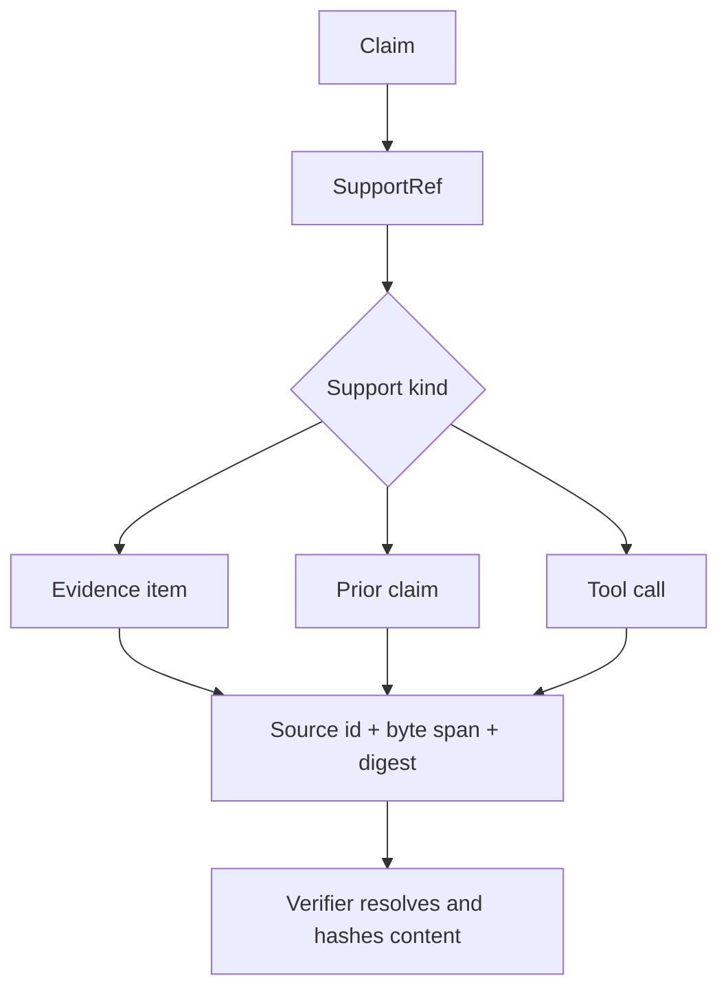
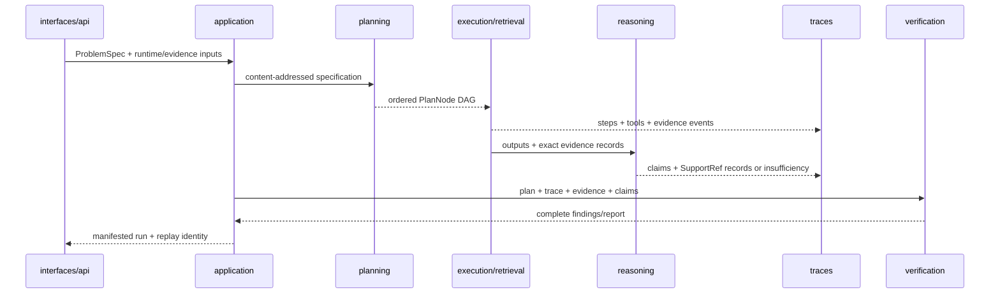

# Module Map

`bijux-canon-reason` owns auditable reasoning from a content-addressed problem
specification to a verified trace. Plans, tool calls, claims, evidence spans,
and verification findings are durable model objects rather than text hidden in
an orchestration loop.

## Ownership by module

| Module | Owns | Use it when |
| --- | --- | --- |
| `core.models` | Stable problem, plan, claim, evidence, tool, trace, runtime, and verification models | Constructing or validating the public reasoning vocabulary |
| `core` | Canonical JSON, fingerprints, stable identifiers, invariants, and shared validation | Establishing content identity or checking model integrity |
| `planning` | Deterministic plan creation and plan topology | Turning a problem specification into ordered reasoning work |
| `execution` | Step execution, local tool dispatch, limits, and runtime interaction | Producing step and tool results under explicit controls |
| `retrieval` | Evidence lookup used by reasoning steps | Supplying bounded source material to a plan |
| `reasoning` | Claim formation, support assignment, and insufficient-evidence behavior | Turning step outputs into challengeable claims |
| `traces` | Event construction, JSONL serialization, fingerprints, and replay | Preserving the complete reasoning record |
| `verification` | Structural, provenance, evidence, support, grounding, and finalization checks | Deciding whether a trace satisfies the reasoning contract |
| `application` | Run construction, artifact manifests, and use-case orchestration | Building a complete reason run |
| `evaluation` | Package-local evaluation workflow and summary artifacts | Exercising the currently implemented fixed evaluation suite |
| `interfaces` | Console commands and serialization boundaries | Running, verifying, or replaying artifacts from a shell |
| `api.v1` | FastAPI health, item, and reasoning-run lifecycle | Exposing reasoning operations over HTTP |

## Evidence is a byte-level contract

An evidence reference identifies a source and its content. A support reference
adds an exact, non-empty byte span and SHA-256 digest for the cited snippet.
Verification resolves those references against the permitted artifact area and
checks the bytes instead of trusting a label that merely says a claim is
supported.

Paths are constrained to the artifact boundary. A syntactically valid path is
not accepted as provenance if it escapes the run or points to bytes that no
longer match the recorded digest.

## Verification order

Verification first validates plan and trace structure, then tool linkage,
claim supports, grounding, reasoning completeness, insufficient-evidence
behavior, finalization, required actions, evidence hashes, and support spans.
This order prevents a polished final claim from masking a malformed trace or a
broken evidence chain.

## Walk one claim through the architecture

Planning cannot manufacture tool results. Execution cannot validate its own
claim supports merely by emitting them. Reasoning cannot omit a failed check
from the verification report. Interfaces publish the manifested result and
typed refusal; they do not synthesize support from final prose.

## Dependency direction

| Layer | May depend on | Must not acquire |
| --- | --- | --- |
| `core` / `core.models` | canonical value, identity and validation primitives | runtime providers, filesystem paths, CLI/HTTP or orchestration |
| `planning` | problem/plan models and stable identity | live tools, evidence mutation or interface policy |
| `execution` / `retrieval` | plan, runtime/tool protocols and evidence records | authority to mark its own claims validated |
| `reasoning` | step outputs, evidence and claim/support contracts | workflow role scheduling or whole-flow acceptance |
| `traces` | typed events and canonical serialization | permission to reinterpret missing history |
| `verification` | immutable plans, traces, evidence, claims and check registry | permission to rewrite the records it checks |
| `application` | the complete use-case graph and run artifact custody | duplicate model/check semantics hidden in orchestration |
| `interfaces` / `api.v1` | application entry points and serializers | reasoning rules embedded in transport handlers |

An external runtime, retriever or tool is supplied through an explicit
protocol and descriptor. It must not be imported into core models or allowed
to bypass trace and verification ownership.

## Package boundaries

The index package retrieves candidates; reason interprets evidence and records
how a claim was formed. The agent package owns iterative lifecycle and
termination. The runtime package owns cross-workflow execution authority and
persistence. A reason trace may be consumed by those packages, but it remains
the authoritative record for claim and support semantics.

## Source and proof

- [`core`](https://github.com/bijux/bijux-canon/tree/main/packages/bijux-canon-reason/src/bijux_canon_reason/core) defines the stable model and identity contract.
- [`verification`](https://github.com/bijux/bijux-canon/tree/main/packages/bijux-canon-reason/src/bijux_canon_reason/verification) contains the ordered checks.
- [`application`](https://github.com/bijux/bijux-canon/tree/main/packages/bijux-canon-reason/src/bijux_canon_reason/application) constructs run artifacts and manifests.
- [`tests`](https://github.com/bijux/bijux-canon/tree/main/packages/bijux-canon-reason/tests) covers determinism, support spans, provenance, replay, and failure paths.
