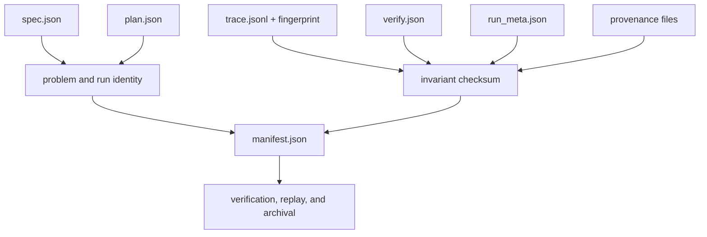
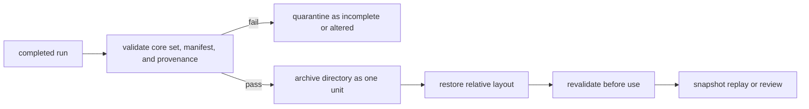

# State and Persistence

A reason run is a self-describing evidence directory. Its durability claim
depends on the complete directory: problem identity, plan, ordered events,
claims, verification, runtime identity, provenance, and manifest are one review
unit. Retaining only the answer or trace breaks that custody chain.

## Durable Layout

The CLI defaults to `artifacts/bijux-canon-reason/runs/<run-id>/`.

```text
<artifacts-root>/runs/<run-id>/
├── spec.json
├── plan.json
├── trace.jsonl
├── verify.json
├── fingerprint.txt
├── run_meta.json
├── manifest.json
├── provenance/
│   ├── retrieval_provenance.json
│   ├── corpus.jsonl
│   ├── chunks.jsonl
│   └── index/
└── replay/
    └── trace.jsonl
```

The core seven files are mandatory. Provenance and replay members appear only
when their capabilities are used.

## Evidence Binding



| File | Evidence carried | Failure meaning |
| --- | --- | --- |
| `spec.json` | canonical problem and content identity | the run's question cannot be established |
| `plan.json` | nodes, dependencies, and plan identity | event order has no governed plan |
| `trace.jsonl` | ordered reasoning, tool, evidence, and claim events | derivation cannot be reconstructed |
| `verify.json` | original checks and findings | the run's verification posture is missing |
| `fingerprint.txt` | canonical trace-file fingerprint | trace identity cannot be confirmed |
| `run_meta.json` | run, runtime, schema, producer, and invariant identities | environment and producer context are unbound |
| `manifest.json` | member inventory and digests | the directory is not a completed bundle |

## Completion And Concurrency

The builder writes members sequentially and finishes with the manifest. There
is no transactional directory commit or status file. A consumer must require
the complete core set and validate the manifest; `trace.jsonl` appearing early
does not mean the run completed.

Run identity is stable for specification identity, preset, seed, and runtime
fingerprint. Identical inputs therefore target the same directory. This is an
identity property, not concurrent-write coordination. Parallel evaluations must
use isolated artifact roots and compare only completed bundles.

Standalone verification writes `verify.verify.json` beside the trace. Replay
writes `replay/trace.jsonl`. These are derived observations. They must retain
their source trace identity and may not overwrite `verify.json` or
`trace.jsonl`.

## Archive And Restore



Evidence and provenance paths are governed relative to the run directory.
Preserve that layout when moving a bundle. Replay refuses missing files,
fingerprint disagreements, provenance drift, and evidence paths outside the
allowed root.

## Retention Decisions

| Condition | Required handling |
| --- | --- |
| verification failed | retain report with the bundle; failure is evidence |
| core member missing | classify incomplete and refuse verification/replay claim |
| digest or invariant mismatch | quarantine; never repair in place and preserve the old identity |
| external evidence retention expires | remove or redact under policy and withdraw claims that require unavailable bytes |
| manual correction required | produce a new bundle and link it to the superseded run |
| restore completed | validate manifest, trace fingerprint, provenance agreement, and path containment before access |

A valid manifest proves integrity, not permission. Record evidence licenses,
privacy classification, retention limits, and deletion obligations in the
deployment policy governing the archive.

See [artifact contracts](../interfaces/artifact-contracts.md) for compatibility
and [failure recovery](../operations/failure-recovery.md) for invalid bundles.
