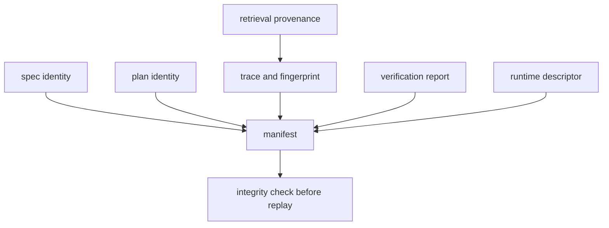

# State and Persistence

A reason run is persisted as a self-describing evidence directory. The
directory binds problem identity, execution, claims, verification, producer
metadata, and optional retrieval provenance into one reviewable unit.

## Run Layout

The CLI defaults to `artifacts/bijux-canon-reason` and creates
`runs/<run-id>/` beneath it.

```text
<artifacts-root>/runs/<run-id>/
├── spec.json
├── plan.json
├── trace.jsonl
├── verify.json
├── fingerprint.txt
├── run_meta.json
├── manifest.json
├── provenance/
│   ├── retrieval_provenance.json
│   ├── corpus.jsonl
│   ├── chunks.jsonl
│   └── index/
└── replay/
    └── trace.jsonl
```

Provenance and replay files appear when the run uses the corresponding
capabilities. The core seven files form the durable run contract.

## What Each Core File Proves

| File | Evidence carried |
| --- | --- |
| `spec.json` | canonical problem declaration and content identity |
| `plan.json` | planned nodes, dependencies, and plan identity |
| `trace.jsonl` | ordered reasoning, claim, and tool events |
| `verify.json` | verification findings produced with the run |
| `fingerprint.txt` | fingerprint of the canonical trace file |
| `run_meta.json` | run, spec, plan, trace, runtime, schema, and producer identities |
| `manifest.json` | inventory, digests, and invariant binding for the run |

The run identifier is stable for the specification identity, preset, seed, and
runtime fingerprint. Reusing those inputs addresses the same run directory;
callers must not treat that as permission for concurrent writers.

## Evidence Binding



`run_meta.json` records the runtime descriptor, its fingerprint, the invariant
checksum, schema version, and producer version. Replay checks the invariant
checksum before reconstruction and validates retrieval-provenance agreement
between the trace and files on disk.

## Write and Concurrency Boundaries

The builder creates the run directory and writes artifacts in sequence, ending
with the manifest. The directory has no separate transactional status file.
Consumers should therefore require the complete core set and a valid manifest;
the mere presence of `trace.jsonl` does not prove a completed run.

Do not run concurrent writers with the same effective run identity into the
same artifact root. Use isolated roots when evaluating the same inputs in
parallel, then compare completed bundles.

Standalone verification writes `verify.verify.json` beside the trace. Replay
writes `replay/trace.jsonl`. These derived files do not replace the original
`verify.json` or `trace.jsonl` recorded by the run.

## Safe Paths and Portability

Retrieval provenance stored for replay uses paths governed by the run
directory. Preserve relative layout when archiving or moving a bundle. Replay
rejects missing provenance, fingerprint disagreements, and attempts to resolve
evidence outside its permitted boundary rather than weakening validation.

## Retention Guidance

- Retain the entire run directory whenever a claim leaves the originating
  process.
- Archive the manifest and all files it binds as one unit.
- Preserve failed verification reports; they are evidence, not disposable
  diagnostics.
- Treat manual edits as a new artifact set and expect digest or replay checks
  to fail.
- Record external evidence licenses and retention limits alongside deployment
  policy; a valid manifest does not grant permission to retain source data.

See [artifact contracts](../interfaces/artifact-contracts.md) for field-level
compatibility and [failure recovery](../operations/failure-recovery.md) for
handling incomplete or invalid bundles.
