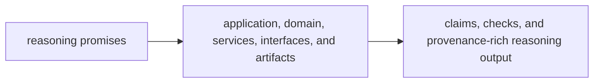

# Capability Map

The capability map for `bijux-canon-reason` should let a reviewer tie reasoning claims to the code that forms, checks, and records them. If the package promise cannot be mapped to named reasoning areas, auditability is already slipping.

## Capability Flow

This page should make reasoning capability feel grounded instead of mystical.
A reviewer should be able to name where claim formation, verification, and
artifact output actually live.

## Capability To Code

- `application/` and reasoning workflows own how evaluation steps are coordinated inside the package boundary
- `domain/` and reasoning services own claim formation, verification, and provenance-aware reasoning behavior
- `interfaces/` and package artifacts own the surfaces where reasoning leaves the package as something reviewable

## Visible Outputs

- claims and checks tied to retrieved evidence
- provenance-rich reasoning artifacts
- reviewable package outputs that agent and runtime can consume

## Design Pressure

Auditability fades quickly when reasoning promises are detached from named code
areas and explicit outputs. The package has to keep meaning, verification, and
artifacts visibly connected.
