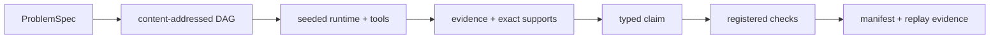

# Capability Map

`bijux-canon-reason` exposes a reproducible reference path from problem
specification to verified, manifested reasoning evidence. Its capabilities
make claims inspectable; they do not turn mechanical verification into a
certificate of truth.

```mermaid
flowchart LR
    spec["ProblemSpec"]
    plan["content-addressed DAG"]
    execute["seeded runtime + tools"]
    evidence["evidence + exact supports"]
    claim["typed claim"]
    verify["registered checks"]
    bundle["manifest + replay evidence"]

    spec --> plan --> execute --> evidence --> claim --> verify --> bundle
```

## Planning and execution capabilities

| Capability | Owning area | Produced evidence |
| --- | --- | --- |
| Problem modeling | `core/models/` | description, constraints, expected output, content identity |
| Deterministic planning | `planning/` | acyclic nodes of understand, gather, derive, verify, and finalize kinds |
| Runtime abstraction | `execution/runtime.py` and tool runtime | runtime kind, mode, tools, versions, and configuration fingerprints |
| Ordered execution | executor and step execution | typed start, tool, evidence, claim, finish, and insufficiency events |
| Frozen replay runtime | `execution/replay_runtime.py` | recorded tool results without live external calls |
| Local pinned retrieval | `retrieval/` | corpus, chunks, BM25 index, ordered results, provenance digests |
| Extractive reasoning | `reasoning/` | supported claim or explicit insufficient-evidence outcome |

## Evidence and verification capabilities

| Capability | Owning area | Produced evidence |
| --- | --- | --- |
| Evidence registration | execution evidence records | URI, content hash, byte span, chunk ID, relative artifact path |
| Claim modeling | `core/models/claims.py` | kind, status, confidence, content ID, exact support references |
| Structural verification | `verification/structural_checks.py` | plan, lifecycle, order, and linkage findings |
| Provenance verification | `verification/provenance_checks.py` | evidence hash, support span, tool, and grounding findings |
| Registry execution | verifier and check registry | all check outcomes, invariant IDs, severity, summary |
| Trace integrity | `traces/` and canonical serializers | semantic trace ID, byte fingerprint, invariant checksum |
| Run publication | `application/run_artifacts.py` | core files, optional evidence/provenance, and per-file manifest digests |
| Replay comparison | `traces/replay.py` and diff logic | replay trace, fingerprints, and structured difference summary |

## Public capabilities

- Python callers can compose typed planning, execution, verification, and
  replay boundaries.
- The CLI creates runs, verifies retained plans and traces, replays from frozen
  evidence, and evaluates named suites.
- HTTP v1 provides file-backed run creation, inspection, verification, replay,
  and a separate lightweight item resource.
- Resource guards bound local disk, wall time, CPU use, and retrieval corpus
  bytes when explicitly configured.

## Capability limits

The reference reasoner is extractive and its local search is BM25. A valid
support span proves byte linkage, not source authority. A passing report proves
registered checks passed, not corpus completeness or factual truth. Frozen
replay proves the recorded inputs and tool returns reproduce the governed
trace, not that an external source still agrees.

See [Invariants](../quality/invariants.md) for the exact structural and
evidence laws and [Known limitations](../quality/known-limitations.md) for the
epistemic and operational boundary.
