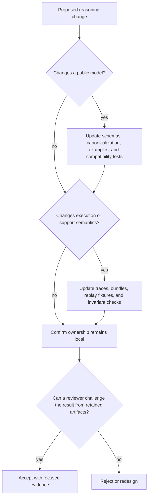

# Change Principles

Changes to `bijux-canon-reason` must preserve the path from a declared problem
to a reviewable claim. More capable planning or generation is useful only when
the retained record remains sufficient to inspect the inputs, reconstruct the
execution, locate every support span, and understand why verification passed or
failed.

## Preserve content-addressed meaning

Identifiers, canonical JSON, trace ordering, byte spans, and digests are part of
the reasoning contract. A change that alters any of them must make the change
observable through versions, schemas, or deliberately changed fingerprints.
Never preserve an old identifier for semantically different content.

Support must remain byte-addressable. A document URI, chunk identifier, or
human-readable quotation alone is not enough: the retained evidence bytes,
exact span, and snippet digest provide the independently checkable connection.

## Preserve explicit outcomes

`insufficient_evidence` is a valid governed result. Do not turn it into an
exception, silently drop it, or replace it with an unsupported answer. Keep
these states distinct:

- the specification or artifact is invalid;
- execution failed before a reasoning result existed;
- execution completed without enough evidence;
- a claim was proposed but failed verification;
- the record passed its configured structural and grounding checks.

A passing report must not be described as proof of source authority,
completeness, calibrated confidence, or real-world truth.

## Preserve the plan, trace, and verification chain

Planning changes require fixtures that prove dependency order and stable plan
identity. Execution changes require typed trace evidence, including failure and
tool-return paths. Claim changes require support and status coverage.
Verification changes require both passing and deliberately failing artifacts,
with failure identifiers that remain useful to operators.

Replay must continue to use frozen tool returns and pinned retrieval inputs.
Running the same question against live tools is a new execution, even if its
seed and visible answer match.

## Keep ownership in the right package

| Change concerns | Owning surface |
| --- | --- |
| parsing, normalization, chunk creation, or embeddings | `bijux-canon-ingest` |
| retrieval contracts, backend capability, ranking, or index isolation | `bijux-canon-index` |
| plans, claims, support, traces, verification, or reasoning replay | `bijux-canon-reason` |
| role scheduling, provider calls, or convergence policy | `bijux-canon-agent` |
| run admission, cross-package policy, effects, or workflow acceptance | `bijux-canon-runtime` |

Moving logic out of reason is appropriate when ownership truly changes. Moving
it merely to avoid documenting a reasoning invariant hides the contract and is
not an architectural simplification.

## Evidence expected with a change

| Changed surface | Minimum focused evidence |
| --- | --- |
| Pydantic model or canonical form | round-trip, rejection, and stable-identity tests |
| plan construction | dependency validation and deterministic fingerprint tests |
| trace event or ordering | canonical JSONL and trace-fingerprint tests |
| evidence or support reference | byte-span, digest, missing-file, and tamper tests |
| verifier | positive and negative invariant fixtures with stable failure output |
| replay | frozen-runtime comparison and missing-input failure tests |
| CLI or HTTP representation | contract and artifact-equivalence tests for the affected surface |

Update the reader-facing examples and artifact descriptions whenever a reviewer
would observe different behavior. Compatibility aliases may delegate to the
canonical interface; they must not acquire independent semantics.

## Refuse the change when

- a claim can no longer be traced to retained support bytes;
- a fingerprint can remain unchanged while its meaning changes;
- replay requires an unrecorded live dependency;
- verification errors are weakened into warnings for convenience;
- provider output or retrieval rank is treated as verified reasoning;
- a new interface can produce results that the canonical artifact contract
  cannot represent; or
- the change makes a reasoning result harder to inspect or challenge.

A sound change increases capability without reducing the evidence available to
the next reviewer.
