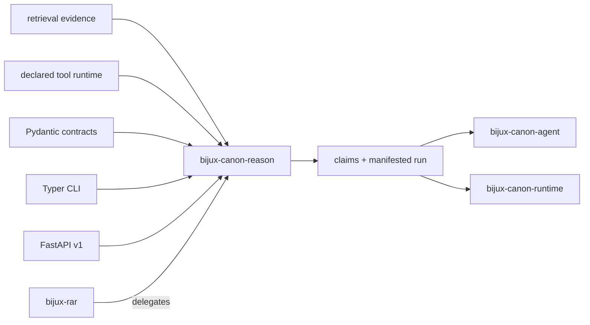

# Dependencies and Adjacencies

`bijux-canon-reason` owns the evidence-to-claim boundary: declared problems,
content-addressed plans, bounded tool calls, typed claims, exact support spans,
verification, and manifested replay evidence. Libraries and neighboring
packages provide inputs or consume outcomes without redefining that boundary.

## Dependency shape

Reason does not require a model-provider SDK in its core dependency set.
Effectful tools enter through the execution-runtime contract and must describe
themselves as part of run identity.

## Dependency roles

| Dependency family | Role | Boundary that remains package-owned |
| --- | --- | --- |
| Pydantic | Strict problem, plan, trace, claim, verification, and runtime models | Canonical identity, invariant checks, and claim semantics |
| Typer | File-backed run, verify, and replay commands | A CLI outcome never substitutes for the complete run directory |
| FastAPI | Optional v1 item and run lifecycle | Artifact-root safety, shared-token behavior, and host-owned network controls remain explicit |
| Local BM25 and extractive reasoner | Deterministic reference retrieval and derivation | They establish a controlled baseline, not a claim of general reasoning quality |
| Application-supplied runtimes and tools | External retrieval, compute, or model effects | Tool inventory, versions, configuration fingerprint, call/result linkage, and replay posture enter the run record |

## Canonical package adjacencies

### Index

Index supplies ordered retrieval results and execution provenance. Reason turns
selected material into `EvidenceRef` and `SupportRef` values. It must preserve
retrieval and content identity rather than treating copied candidate text as
complete provenance.

### Agent

Agent coordinates roles and workflow progression around reason operations. It
may judge whether a reasoning output is sufficient for a workflow, but it must
not rewrite claim status, support spans, verification findings, or the
historical trace.

### Runtime

Runtime governs the larger execution and applies final acceptance policy.
Reason retains ownership of plan identity, tool linkage, claim derivation,
evidence verification, and reasoning replay. Runtime acceptance does not turn
an unsupported claim into a supported one.

### Compatibility package

`bijux-rar` delegates legacy command behavior to the canonical reason package.
It is not a second planner, verifier, or artifact authority. Contract changes
start in the canonical package and are deliberately projected through the
compatibility surface.

## Handoff contract

A complete downstream handoff includes the run directory, not just final text:

- normalized `ProblemSpec` and content identity;
- plan DAG, preset, seed, and execution policy;
- ordered trace with tool calls, results, evidence, claims, and action links;
- exact evidence paths, file digests, byte spans, and snippet digests;
- verification report, policy, failures, and invariant identities;
- runtime kind, mode, tools, versions, and configuration fingerprint;
- trace fingerprint, run metadata, provenance files, and manifest.

The [integration seams](../architecture/integration-seams.md) explain each
boundary. [Artifact contracts](../interfaces/artifact-contracts.md) define the
files and digests that make the handoff independently inspectable.
